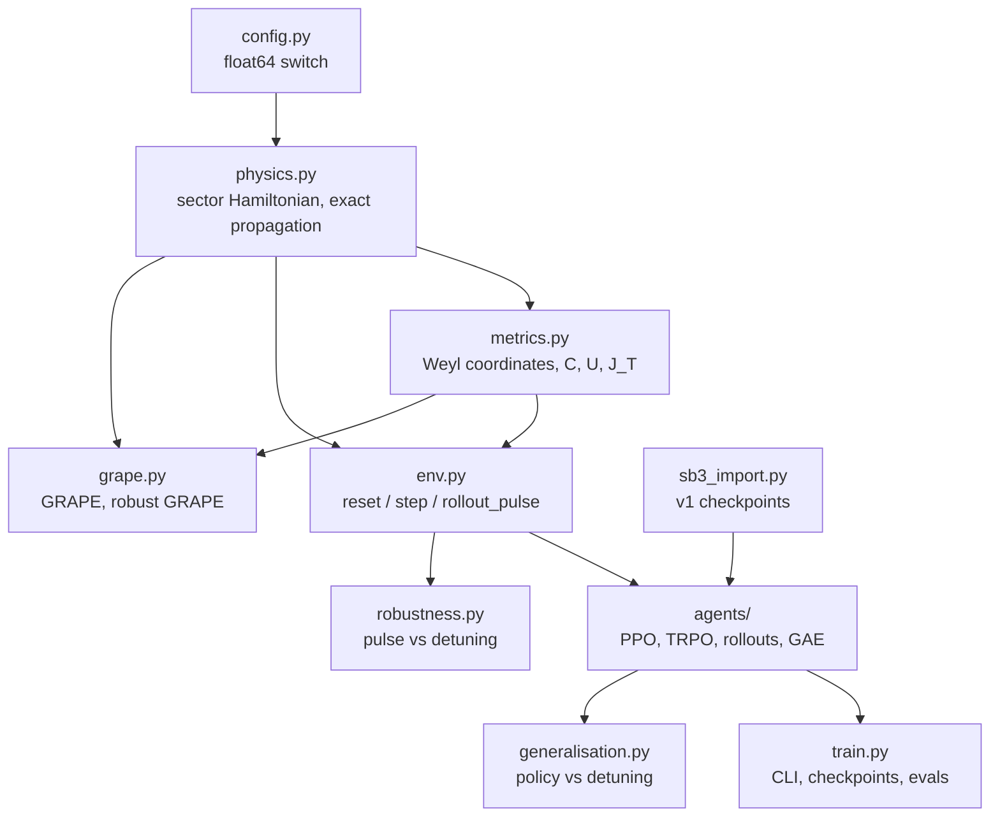

# Architecture

`rlquantopt/jx` is a small stack of pure functions. Physics at the bottom, an environment built
from it, then two consumers: RL agents that learn a policy, and GRAPE that differentiates straight
through the simulator.



Everything above `env.py` depends only on arrays, so any piece can be `jax.jit`-ted, run on a
batch with `jax.vmap`, or differentiated with `jax.grad`.

## Modules

| Module | Main functions | Read it when |
| --- | --- | --- |
| `config.py` | `cdtype()`, `fdtype()` | You change precision |
| `physics.py` | `sector_hamiltonian`, `propagate`, `realised_gate` | You change the model (levels, couplings, noise) |
| `metrics.py` | `c1c2c3`, `concurrence`, `unitarity`, `cost_JT` | You change the target or the reward |
| `env.py` | `reset`, `step`, `step_autoreset`, `rollout_pulse` | You change the MDP (actions, observation, reward) |
| `agents/common.py` | `ActorCritic`, `collect`, `gae`, `evaluate` | You touch any agent |
| `agents/trpo.py`, `agents/ppo.py` | `init`, `make_update` | You tune or change an algorithm |
| `train.py` | `main` | You launch runs |
| `grape.py` | `optimise`, `ensemble_hamiltonian`, `qsl_scan` | You want gradient-based pulses |
| `robustness.py` | `detuning_map`, `load_pulse_csv` | You evaluate a fixed pulse |
| `generalisation.py` | `sweep`, `island_extent` | You evaluate a policy on detuned systems |
| `sb3_import.py` | `load_sb3_policy` | You load a v1 agent |

## Patterns used everywhere

**Static configuration, dynamic state.** Configurations are frozen dataclasses (`EnvConfig`,
`TRPOConfig`, `GrapeConfig`). They are passed as static arguments, because they fix array shapes
and loop lengths. Everything that changes during a run is a pytree of arrays (`EnvState`,
`RunnerState`).

```python
step = jax.jit(jenv.step, static_argnums=2)        # cfg must be hashable and is compiled in
```

**Batching by `vmap`, looping by `scan`.** A batch of environments is `jax.vmap(jenv.step)`; a
rollout is `jax.lax.scan` over time. The whole TRPO update (rollout, GAE, actor step, critic
epochs) is one compiled function.

**Parameters as data.** Physical parameters can be traced arrays, so a sweep over qubit
frequencies is a `vmap` over `omega_s`:

```python
ham = physics.sector_hamiltonian(model._replace(omega_s=omega))   # omega may be a traced array
```

This is what makes domain randomisation, robustness maps and robust GRAPE cheap.
