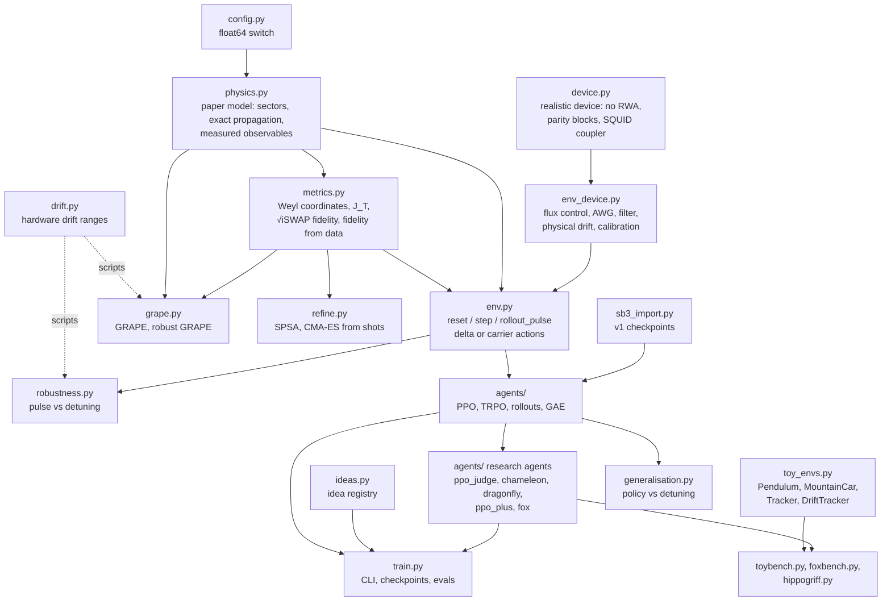

# Architecture

`rlquantopt/jx` is a small stack of pure functions. Physics at the bottom, an environment built
from it, then two consumers: RL agents that learn a policy, and GRAPE that differentiates straight
through the simulator. Since v2.17 a third layer sits on top: the [idea farm](../ideas/index.md),
research agents and benchmarks that reuse the same pieces.



Everything above `env.py` depends only on arrays, so any piece can be `jax.jit`-ted, run on a
batch with `jax.vmap`, or differentiated with `jax.grad`.

## Modules

**Core** (the paper's problem and its baselines):

| Module | Main functions | Read it when |
| --- | --- | --- |
| `config.py` | `cdtype()`, `fdtype()` | You change precision |
| `physics.py` | `sector_hamiltonian`, `propagate`, `realised_gate`, `measured_observables` | You change the paper model (levels, couplings) or what is measured |
| `metrics.py` | `c1c2c3`, `concurrence`, `unitarity`, `cost_JT`, `fidelity_free_z`, `fidelity_from_observables` | You change the target or the reward |
| `drift.py` | `DRIFT_RANGES` (in-cooldown, recool, fabrication targeting), `box_grid` | You change a drift range ([Hardware drift ranges](../system/drift.md)) |
| `env.py` | `EnvConfig`, `reset`, `step`, `step_autoreset`, `rollout_pulse` | You change the MDP: observation, action, reward, shots, calibration |
| `agents/common.py` | `ActorCritic`, `collect`, `gae`, `evaluate` | You touch any agent |
| `agents/ppo.py`, `agents/trpo.py` | `init`, `make_update` | You tune or change an algorithm ([Agents and training](agents.md)) |
| `train.py` | `main` | You launch runs ([Scripts and CLI](scripts.md#rlquantoptjxtrain)) |
| `grape.py` | `optimise`, `ensemble_hamiltonian`, `qsl_scan` | You want gradient-based pulses ([GRAPE](grape.md)) |
| `robustness.py` | `detuning_map`, `load_pulse_csv` | You evaluate a fixed pulse |
| `generalisation.py` | `sweep`, `island_extent` | You evaluate a policy on detuned systems |
| `sb3_import.py` | `load_sb3_policy` | You load a v1 agent |

**Idea farm** (research agents, benchmarks and the newer models; [Research agents](idea-agents.md)):

| Module | Main functions | Idea |
| --- | --- | --- |
| `ideas.py` | `IDEAS`, `run_root` | The registry: number, codename, summary; `--idea` routes runs to `runs/iNN_<animal>/` |
| `agents/autoregressive.py`, `agents/ppo_judge.py` | `ARActorCritic`, `help_targets`, `make_update` | 🐸 axolotl, 🦡 badger |
| `agents/chameleon.py`, `agents/dragonfly.py` | `act`, `model_loss` | 🐲 chameleon, 🦋 dragonfly |
| `agents/ppo_plus.py`, `toy_envs.py`, `toybench.py` | `act`, `update_cache`, `Tracker`, `DriftTracker` | 🦔 echidna (and the toy test bed of fox and hippogriff) |
| `agents/fox.py`, `foxbench.py` | `ImprovementModel`, `FoxAdapter` | 🦊 fox |
| `hippogriff.py` | `ekf_update`, `grid_update`, `make_episode` | 🦄 hippogriff |
| `refine.py` | `spsa`, `cmaes`, `make_device` | 🦩 ibis |
| `device.py`, `env_device.py` | `block_hamiltonian`, `propagate`, `gate`; `reset`, `step` | 🐺 jackal |

## Patterns used everywhere

**Static configuration, dynamic state.** Configurations are frozen dataclasses (`EnvConfig`,
`PPOConfig`, `TRPOConfig`, `GrapeConfig`). They are passed as static arguments, because they fix array
shapes and loop lengths. Everything that changes during a run is a pytree of arrays (`EnvState`,
`RunnerState`).

```python
step = jax.jit(jenv.step, static_argnums=2)        # cfg must be hashable and is compiled in
```

**Batching by `vmap`, looping by `scan`.** A batch of environments is `jax.vmap(jenv.step)`; a
rollout is `jax.lax.scan` over time. A whole PPO or TRPO update (rollout, GAE, all gradient steps) is
one compiled function, and so is a hippogriff deployment episode with its belief updates.

**Parameters as data.** Physical parameters can be traced arrays, so a sweep over qubit
frequencies is a `vmap` over `omega_s`:

```python
ham = physics.sector_hamiltonian(model._replace(omega_s=omega))   # omega may be a traced array
```

This is what makes domain randomisation, robustness maps and robust GRAPE cheap: every environment in a
batch carries its own Hamiltonian in its state (`state.ham`), drawn at reset.

**Switches, not forks.** New behaviour enters as a configuration field whose default reproduces the
previous behaviour (`objective="pe"`, `obs_mode="amplitudes"`, `oob_mode="terminate"`, `action_mode="delta"`,
`physics_model="rwa"`, `shots=0`), and the v1 equivalence tests run on those defaults. A Python branch on a
static field compiles only the chosen path; a branch on data uses `jnp.where`.

**One interface for every environment.** The gate environment, the realistic device (behind the same
`reset` / `step` in `env.py`) and the toy environments share the functional
`reset(key) → (obs, state)`, `step(state, action) → (obs, state, reward, terminated, truncated, info)`
interface, so ingredients can be tested on a toy and moved to the gate problem unchanged.
