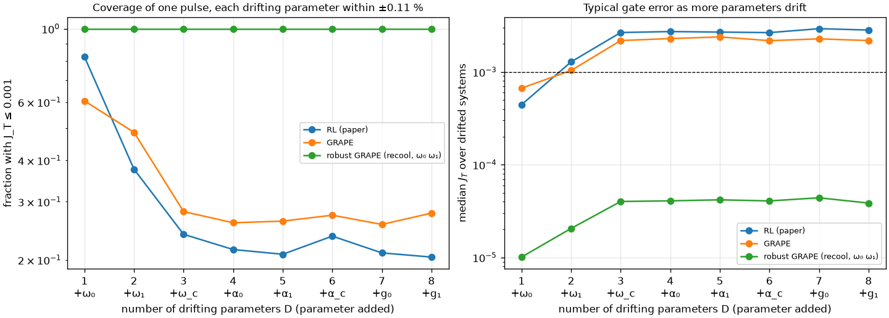
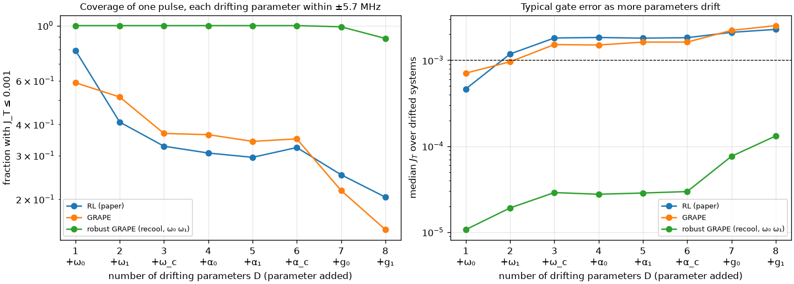
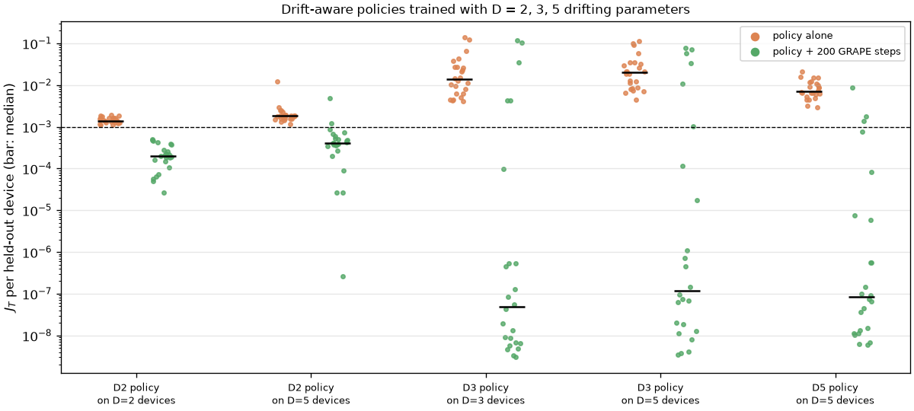

# Drift, dimension and learned policies

This page states the project's central hypothesis, sharpens it into claims that can be tested,
collects what the literature and our own experiments say for and against each claim, and lists the
experiments that would settle it. It is a working document: a claim moves to "supported" only when
the evidence below supports it.

## The hypothesis

> Environment drift blows up the space a controller has to cover faster than, and in proportion to,
> the dimensional size of the problem. Finding a *policy* with reinforcement learning is therefore
> informationally far more efficient than gradient-derived techniques once theory meets the limits
> of real hardware.

The intuition: a gradient method returns one pulse for one device state. When the device drifts,
it must be run again. A policy maps the device state to a pulse, so it answers every future
calibration at once. If the number of calibrations a device needs grows quickly with the number of
things that can drift, the policy's up-front cost is paid back more and more quickly.

To test it, we split it into three claims.

| Claim | Statement | Status |
| --- | --- | --- |
| **H1: drift multiplies the problem** | The number of distinct calibrations needed to keep a gate below an error target over a drift range grows multiplicatively with the number of *sensitive* drifting parameters, and that number grows with the size of the processor. | Partly supported: multiplicative over sensitive parameters, but in the two-qubit model one robust pulse still covers ±18.5 MHz |
| **H2: policies amortise** | A policy trained over the drift distribution produces a good pulse for a new device state at a small fraction of the cost of re-optimising, so its total cost wins beyond some number of calibrations. | Supported as a warm start, at matched gate time (1-3 orders of magnitude better than a random start at equal GRAPE budget); not supported for the policy alone, which does not reach J_T ≤ 1e-3 |
| **H3: hardware limits favour policies** | On hardware, gradients must be estimated from measurements, at a cost that grows with the number of pulse parameters and the shot noise, which removes most of the advantage gradient methods have in simulation. | Supported by the literature in principle; not yet tested here |

## What the literature says

**Drift is a real, recurring cost.** Optimal control parameters "are typically different between
devices and can also drift in time, which begets the need for an efficient calibration strategy"
[[kelly2018]](../bibliography.md#kelly2018). Errors "typically fluctuate over time", and tools that
assume static errors cause "unheralded failures" and "wasted experimental effort"
[[proctor2020]](../bibliography.md#proctor2020). Our own [drift ranges](../system/drift.md) put numbers
on this for transmons: kHz within a cooldown, 5.7 MHz across a thermal cycle, 18.5 MHz between devices
[[zhang2022]](../bibliography.md#zhang2022).

**Calibration scales badly with processor size (H1).** Scaling gates to large processors "often maps
to non-convex, high-constraint, and time-dependent control optimization over an exponentially
expanding configuration space" [[klimov2024]](../bibliography.md#klimov2024). This is the strongest
published support for H1, for joint frequency configurations of a whole processor.

**Amortisation can be orders of magnitude faster, after training (H2).** Learning to predict
solutions across related problem instances can "solve optimization problems many orders of magnitude
faster than traditional optimization methods that don't use amortization"
[[amos2023]](../bibliography.md#amos2023). This is the precise sense in which "orders of magnitude"
is defensible: per new instance, once the model is trained, not in total and not for one instance.

**Gradients on hardware are expensive (H3).** Analytic gradients of a quantum circuit can be
estimated on hardware, but each parameter needs its own shifted evaluations
[[schuld2019]](../bibliography.md#schuld2019), so the cost of one gradient grows with the number of
parameters (345 per pulse here), times the shots needed to resolve an error of 1e-4. Hybrid schemes
that combine a model with measured data exist, precisely because model gradients alone miss the real
device: Ad-HOC [[egger2014]](../bibliography.md#egger2014) and data-driven GRAPE using tomography
[[wu2018]](../bibliography.md#wu2018).

**What the literature contradicts.** For a single problem instance, methods that only see
function values (as model-free RL does with rewards) are provably slower than gradient methods.
For convex problems, such methods "usually need at most n times more iterations than the standard
gradient methods, where n is the dimension of the space of variables"
([[nesterov2017]](../bibliography.md#nesterov2017), abstract). Gate optimisation is not convex, so the
bound is a guide rather than a theorem here, but the direction is clear: here n = 345 pulse samples. So "RL is orders of magnitude more efficient than
any gradient technique" is **false per instance**. Our own data agree: GRAPE needs 7.0e5 simulated
samples per device, while training the RL agent took 6.0e7.

!!! warning "What can and cannot be claimed"
    The defensible claim is about **total cost over many drifting device states**, and about
    **settings where exact gradients are not available** (hardware). It is not a general claim that
    policy search beats gradient descent.

## Evidence from our experiments

### H1: coverage as more parameters drift

One pulse, optimised for the nominal device, is evaluated on 1,000 drifted systems as the number of
drifting parameters D grows, adding them in the order ω₀, ω₁, ω_c, α₀, α₁, α_c, g₀, g₁. The left
figure uses the recool spread for every parameter as a fraction of its value (±0.11 %; measured for
the qubit frequencies, assumed for the rest). The right figure is a stylised stress test in which
every parameter drifts by the same ±5.7 MHz.

| Pulse | Covered (J_T ≤ 1e-3), D = 1 → 3 → 8, relative drift | Same, ±5.7 MHz on every parameter |
| --- | --- | --- |
| RL (paper) | 82 % → 24 % → 20 % | 80 % → 33 % → 20 % |
| GRAPE (nominal) | 61 % → 28 % → 28 % | 59 % → 37 % → 15 % |
| Robust GRAPE (trained on ω₀, ω₁) | 100 % → 100 % → 100 % | 100 % → 100 % → 89 % |

What this shows:

- **Coverage falls multiplicatively, but only over sensitive directions.** Each qubit or coupler
  frequency that drifts removes a large share of the coverage. At realistic relative drift, the
  anharmonicities and couplings move by only 0.1-0.4 MHz and barely matter, so coverage flattens after
  D = 3. The number that matters is the *effective* dimension: the drifting parameters the gate is
  sensitive to.
- **Robustness does not transfer to directions it was not trained on.** Robust GRAPE, whose ensemble
  covers only ω₀ and ω₁, loses coverage once the couplings drift by ±5.7 MHz (D = 7, 8). Every
  sensitive drifting parameter must be in the ensemble, and a grid ensemble with m points per
  parameter has m^D members, which makes robust optimisation exponentially costly in D.
- **For H1 on a whole processor** the effective dimension grows with the number of qubits and
  couplers, since each has its own frequency. For a strictly local two-qubit gate, only its own
  neighbourhood matters; the exponential growth [[klimov2024]](../bibliography.md#klimov2024)
  describes arises from the joint configuration of many gates and from crosstalk. A three-qubit model
  with a spectator is needed to test this here.

### H2: amortisation

From [Robustness: cost per device](../results/robustness.md#rl-vs-grape-cost-per-device):

- A PPO agent trained over the recool drift gives consistent gates on every held-out device, and as a
  warm start it cuts GRAPE's per-device cost 18× (3.8e4 vs 7.0e5 simulated samples).
- Its training (6.0e7 samples) pays back after ≈ 90 devices or recalibrations.
- Within the recool range, and even over the ±18.5 MHz fabrication range, a single robust GRAPE pulse
  covers two drifting frequencies ([fabrication-range experiment](../results/robustness.md#fabrication-range-experiment)).
- At matched gate time, the policy's pulse is a far better GRAPE starting point than a random guess:
  1-3 orders of magnitude lower J_T at equal GRAPE budget. A policy trained for only 2M steps is
  already a good warm start, which moves the break-even to about 13 devices.

### T1: policies trained with more drifting parameters

Three PPO policies (seed 123, 20M steps each) trained with drift redrawn every episode over D = 2
(both qubit frequencies, ±0.11 %), D = 3 (+ coupler frequency, ±5.7 MHz) and D = 5 (+ both
couplings, ±5.7 MHz), tested on the same 24 held-out devices drifting in D = 5 (and in their own
dimensions). Script: `scripts/drift_dimension_policies.py`.

| Policy | Tested on | Policy alone: median J_T | + 200 GRAPE steps: median J_T | Reach 1e-3 | Median gate time |
| --- | --- | --- | --- | --- | --- |
| D = 2 | D = 2 devices | 1.4e-3 | 2.0e-4 | 100 % | 38 ns |
| D = 2 | D = 5 devices | 1.8e-3 | 4.0e-4 | 92 % | 36 ns |
| D = 3 | D = 3 devices | 1.4e-2 | 5.0e-8 | 79 % | 40 ns |
| D = 3 | D = 5 devices | 2.0e-2 | 1.2e-7 | 75 % | 41 ns |
| D = 5 | D = 5 devices | 7.0e-3 | 8.3e-8 | 88 % | 42 ns |

Control on the D = 5 devices: GRAPE from a random guess at each device's D = 5 gate time reaches a
median of 1.1e-2 after 200 steps (0 % below 1e-3) and 8.1e-5 after 500 (92 %).

What T1 shows, honestly:

- **At equal budget, training over more drifting parameters made the policy alone worse**
  (1.4e-3 for D = 2 against 7.0e-3-1.4e-2 for D = 3 and 5, on their own devices). That fits the
  hypothesis that drift dimensions make the control problem harder.
- **But the D = 2 policy already works on D = 5 devices** (1.8e-3): at ±5.7 MHz, coupler and coupling
  drift barely hurt it. The extra dimensions were not sensitive enough in this model to require the
  policy to know about them, so the harder training bought nothing here.
- **As warm starts, all policies stay strong.** Every policy + 200 GRAPE steps beats GRAPE from a
  random start at the same gate time and budget by a wide margin.
- **One seed per setting.** The ordering of D = 3 and D = 5 (D = 5 better) is within seed-to-seed
  spread ([Training](../results/training.md) found 9× between seeds).

T1 therefore does not yet test H1 where it matters: a setting in which the added drift dimensions
are sensitive enough that no single pulse covers them. That needs larger drift in the coupler (a
flux-tunable element, see [Hardware drift ranges](../system/drift.md#what-is-not-covered-yet)) or a
larger system (T5).

### H3: not tested yet

All results here use exact simulator gradients, which is the setting most favourable to GRAPE. On
hardware, each GRAPE step would need gradient estimates for 345 parameters from shots; RL would learn
from the rewards alone.

## A scaling argument, with its assumptions

If a pulse tolerates drift within a fraction \(p_i\) of the range of each sensitive parameter
\(i\), independently, the share of a D-dimensional drift box it covers is about
\(\prod_i p_i\), and the number of distinct calibrations needed to cover the box in advance is about

\[
N_\text{cal} \approx \prod_{i=1}^{D_\text{eff}} \frac{1}{p_i} \;\sim\; p^{-D_\text{eff}},
\]

exponential in the effective dimension. Re-optimising on demand costs \(N \cdot c_\text{opt}\) for N
encountered device states; a policy costs \(C_\text{train} + N \cdot c_\text{inf}\), with
\(c_\text{inf} \ll c_\text{opt}\). The policy wins for \(N > C_\text{train}/(c_\text{opt} - c_\text{inf})\).
The hypothesis holds if \(C_\text{train}\) grows more slowly with \(D_\text{eff}\) than \(p^{-D_\text{eff}}\),
that is, if the map from device state to good pulse is smooth enough to be learned without sampling
every region of the drift box. That is an assumption about the physics, and it is exactly what the
tests below measure.

Two caveats. The independence assumption is optimistic for a pulse (drifts can partly cancel) and
pessimistic for a robust pulse (which is optimised against the drift). And a single robust pulse can
cover a box much larger than a nominal pulse can, as the recool results show; the argument applies
once the range exceeds what any single pulse can cover.

## Tests that would settle it

| Test | Measures | Supports the hypothesis if |
| --- | --- | --- |
| **T1** Train drift-aware policies with 2, 3 and 5 drifting parameters (ω₀ ω₁; + ω_c; + g₀ g₁) at equal budget | Policy quality and per-device warm-start cost versus D | Quality and warm-start cost degrade slowly with D. **Done (v2.14.0):** warm starts stay strong for every D; the policy alone got worse with D, but the added parameters were not sensitive enough to matter |
| **T2** Robust GRAPE with grid and random ensembles versus D | Cost to reach a coverage target | Cost grows quickly with D |
| **T3** Fabrication-range comparison | Whether one robust pulse still suffices over ±18.5 MHz | Per-device or policy methods overtake the single robust pulse. **Done (v2.14.0): one robust pulse still suffices** (J_T ≤ 7.6e-4); the RL warm start beats per-device GRAPE at matched gate time |
| **T4** GRAPE with gradients estimated from finite shots (parameter-shift or finite differences) versus RL learning from shot-noisy rewards | Measurements per device to reach J_T ≤ 1e-3 | RL needs fewer measurements per device, including amortised training |
| **T5** Three-qubit model with a spectator | Effective dimension versus system size | D_eff, and the calibrations needed, grow faster than linearly |

Figures on this page: `scripts/drift_dimension.py` (relative drift) and
`scripts/drift_dimension.py --absolute-mhz 5.7 --tag _absolute`.
