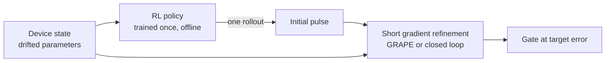

# RL-initialised optimal control

**The proposal.** Treat reinforcement learning not as a replacement for quantum optimal control but
as its initialiser. A policy trained once over the distribution of devices a platform will meet
(drift, fabrication spread) produces, for any new device state, a pulse in one forward pass; a short
gradient refinement (GRAPE, or a closed-loop optimiser on hardware) then finishes the job. In machine
learning terms this is *semi-amortised* optimisation: an amortised model predicts a solution, and an
iterative solver refines it [[amos2023]](../bibliography.md#amos2023).

## What our experiments already show

| Evidence | Numbers | Where |
| --- | --- | --- |
| The warm start is informative, not an artefact of pulse length | At equal gate time and 200 GRAPE steps: median J_T 1.4e-5 from the RL pulse vs 1.3e-2 from a random start (100 % vs 0 % of devices below 1e-3), fabrication-range devices | [Robustness](../results/robustness.md#the-gate-time-confound-and-its-control) |
| It holds as drift dimensions are added | Policies trained with 2, 3 or 5 drifting parameters all refine to the target on 75-100 % of devices within 200 steps; on the D = 5 devices a random start at the same gate time reaches 0 % | [T1](drift-and-dimension.md#t1-policies-trained-with-more-drifting-parameters) |
| It matters where one pulse fails | Coupler over ±140 MHz: a robust 17.25 ns pulse reaches J_T ≤ 1e-3 on 0 % of devices; 100 GRAPE steps from the policy's pulse reach 83 %, random starts at the same gate time 0 % (they need ~1000) | [Large coupler drift](../results/robustness.md#large-coupler-drift) |
| The policy alone is not enough | Median J_T 1.4e-3 to 2e-2 across experiments; the refinement is what reaches the target | [Robustness](../results/robustness.md) |
| Pretraining pays back | In logical-core time, break-even against per-device GRAPE after ~220-350 devices with full training (0.81 core-hours), ~36 with a 2M-step policy (5 core-minutes) | [Robustness](../results/robustness.md#training-and-refinement-budgets) |
| Cheap to train | A usable policy in 2M environment steps: 5 core-minutes on a laptop CPU with the JAX environment | [Training](../results/training.md) |

## The literature around it

| Line of work | What it does | What it leaves open |
| --- | --- | --- |
| RL as an ansatz for GRAPE [[sarma2025]](../bibliography.md#sarma2025) | An RL pulse initialises GRAPE for a tunable-coupler CZ gate: 10 ns at ~4e-3, below 1e-4 at 20 ns | One fixed system; no drift, no amortisation across devices, no cost accounting |
| Amortised pulse generators [[kiermeyer2026]](../bibliography.md#kiermeyer2026), [[luchi2026]](../bibliography.md#luchi2026) | One network maps Hamiltonian or target parameters to pulses, in milliseconds, matching multi-seed GRAPE (model-based RL; Lie-algebra-based interpolation) | Used as final solutions, without refinement; not evaluated against measured hardware drift |
| Warm starts from similar precompiled pulses [[cheng2020]](../bibliography.md#cheng2020) | Reuses pulses of similar gate groups to seed optimisation: 9.88× faster pulse compilation | Similarity lookup, not a learned policy; circuits, not device drift |
| Model-free RL calibration on hardware [[li2024]](../bibliography.md#li2024), [[ding2023]](../bibliography.md#ding2023) | RL tunes pulse parameters on the device and reaches record CZ fidelities (99.90 %, 99.922 %) | Per device, from scratch; not reused across devices or cooldowns |
| Learned warm starts in robotics [[lembono2020]](../bibliography.md#lembono2020) | A "memory of motion" maps tasks to good initial trajectories for a trajectory optimiser; ensembles of function approximators work best | The same idea, in robotics; no counterpart in quantum control under drift |
| Amortised and semi-amortised optimisation [[amos2023]](../bibliography.md#amos2023) | Theory and practice of learning to predict solutions, optionally followed by refinement | General; not specialised to control with drifting, partially known dynamics |

**The gap.** We found no quantum-control work that (1) trains a policy over a hardware-calibrated
drift distribution, (2) uses it as a warm start for gradient refinement on each new device state,
(3) accounts the total cost against per-device optimisation and robust optimisation at matched gate
time, and (4) measures how this scales with the number of drifting parameters. Each ingredient exists
somewhere; the combination, and the cost analysis under realistic drift, does not.

## What would make it a contribution

1. **A named gate and a realistic model** (v3), so that the numbers compare with the literature.
2. **Hardware-shaped constraints**: the vendor's sampling rate, amplitude and bandwidth limits, and
   the refinement done from measured data (finite shots), not exact gradients. This is test T4 of the
   [hypothesis](drift-and-dimension.md#tests-that-would-settle-it).
3. **A scaling study** where a single robust pulse fails, since that is where the framework should win.
   Large coupler drift is the first such case here ([results](../results/robustness.md#large-coupler-drift));
   more qubits, or a platform whose drift dimension grows with system size, are next.
4. **One hardware demonstration.** Even a small one: a policy trained in simulation, refined on the
   device across two cooldowns or two devices.

## Risks, stated plainly

- **Robust optimisation may cover the relevant drift** as it did here up to ±18.5 MHz of qubit drift,
  removing the need for per-device adaptation. The framework's value is conditional on drift that no
  single pulse covers; ±140 MHz of coupler drift is such a case at 17.25 ns, but a longer robust pulse
  is untested.
- **Longer gates.** Our policies choose 36-45 ns gates, against 17 ns for GRAPE. On hardware, gate time
  costs coherence; the policy should be trained with a gate-time penalty or a fixed duration.
- **The simulator gap.** A policy trained on an idealised model may give a poor warm start on hardware.
  Training on hardware-shaped models and randomising the model itself are the mitigations.
