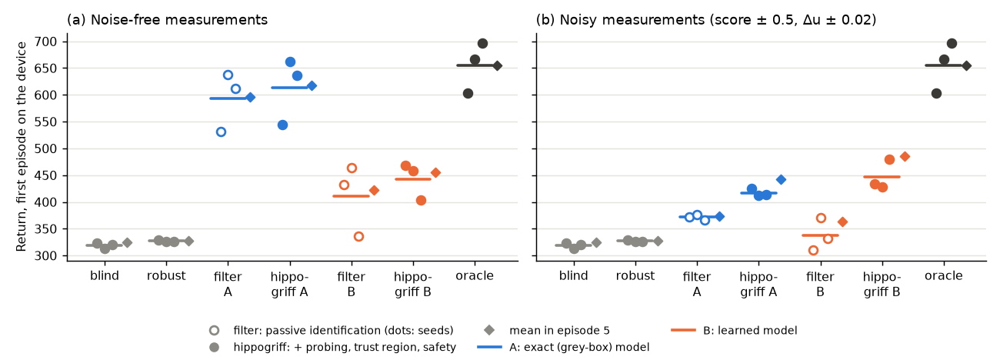
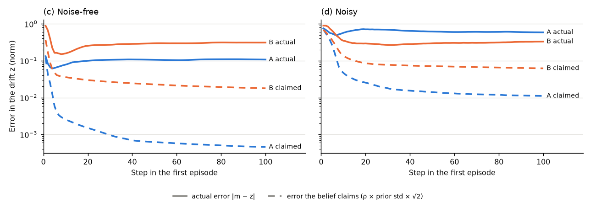

# 🦄 i08 hippogriff: know the device first, then act

**Question.** Merge dragonfly's structure (a latent, caution, directed exploration) with fox's empiricism.
On a new device, can an agent first identify the drift, with an uncertainty that is largest at the first
action and shrinks with every interaction, and then act on what it has learned, instead of re-training?
(A hippogriff is the offspring of a griffin and a horse: a hybrid of a hybrid.)

**Answer so far.** Largely yes, on the toy devices, with one important flaw. Identifying the drift
lifts the first-episode return from 327 (a robust policy) to 614 of the oracle's 655, where black-box
fine-tuning ([fox](fox.md)) barely recovered after 60 updates. Probing for information pays: the full
method beats passive identification in 11 of 12 seed × setting pairs, by +21 to +110. But the belief
becomes badly overconfident: its uncertainty shrinks as designed, around a wrong value, claiming an error
9× to 890× smaller than its actual error, so later episodes barely improve on the first.

## The key idea: a belief that can only sharpen

A model that *imagines* a rollout (chameleon, dragonfly) accumulates error with every imagined step.
Deployment is different: every real interaction adds information. With a Gaussian belief
\(\mathcal N(m, P)\) over the drift *z* and each interaction treated as a (linearised) measurement
\(y = h(s, a, z) + \text{noise}\), the Kalman update

\[
P^{-1}_{k+1} = P^{-1}_k + J^\top R^{-1} J \ \succeq\ P^{-1}_k, \qquad J = \partial h / \partial z,
\]

can only shrink the uncertainty. Autoregression here is over interactions (the belief is recursive), not
over action dimensions ([axolotl](axolotl.md)'s mistake), and the only structure the policy and the model
share is the drift latent *z*.

## Design (`hippogriff.py`, `toy_envs.DriftTracker`)

**Stage 1, simulation.**

- PPO with domain randomisation over the drift range, the policy conditioned on the drift:
  \(\pi(a \mid s, z)\), *z* the device's normalised (gain, offset) in \([-1, 1]^2\).
- A **blind** control that never sees *z*: the classic robust policy.
- [Fox](fox.md)'s improvement model rides along during PPO (no exploitation), and its calibration is
  logged.

**Stage 2, deployment**, the drift unknown:

- The **belief** starts at the prior (the whole range: mean 0, variance 1/3 per dimension) and is updated
  after every step by an extended Kalman filter (Joseph form), with the measured change of the commanded
  amplitude and the tracking score as *y*.
- The **measurement model** is either the environment's own differentiable `measure` (**A**, grey box:
  the physics is known, only its parameters drift, and *J* comes from autodiff through the simulator), or
  a network trained on simulated transitions (**B**, black box; its *R* from held-out residuals).
- **Trust region**: actions are clipped to \(c = c_\min + (1 - c_\min)(1 - \rho)\), with
  \(\rho = (\det P / \det P_0)^{1/2d}\): small first actions, widening as the uncertainty shrinks.
- **Safety**: a candidate action is vetoed if the model predicts an overshoot at any sigma point of the
  belief.
- **Probing**: while \(\rho > 0.1\), the candidate with the largest expected information gain,
  \(\tfrac12 \log\det(I + R^{-1} J P J^\top)\), is chosen. Afterwards, \(\pi(a \mid s, m)\).

Modes compared on the same held-out devices as fox: **blind**, **robust** (*z* fixed at the prior mean),
**oracle** (true *z*), **filter** (the belief updates *z*, actions from π: passive identification) and
**hippogriff** (filter + trust region + safety + probing), each filter with model A and B.

## Smoke test (1 seed, 4 devices, 300k pretraining steps, 3 episodes per device)

| Mode | Episode 1 | Episodes 2-3 | Drift error after episode 1 |
| --- | --- | --- | --- |
| blind | 314 | 312-314 | – |
| robust | 305 | 303-306 | 0.85 |
| filter A | **463** | 461-465 | 0.000 |
| hippogriff A | 461 | 461-465 | 0.000 |
| filter B | 461 | 462-465 | 0.084 |
| hippogriff B | 456 | 462-465 | 0.085 |
| oracle | 464 | 461-465 | – |

The learned measurement model (B) explains 97-99.9 % of the variance of its outputs on held-out
transitions. Fox's model, monitoring pretraining, predicted return changes early in training (correlation
0.30-0.36 with the realised change) but not near convergence (−0.08 to −0.30 in the second half).

## Full results (3 seeds × 12 devices × 5 episodes, 2M pretraining steps)

Noise-free measurements, and noisy ones (amplitude change ± 0.02, tracking score ± 0.5, like finite shots
on hardware; the filter knows the noise level). Return per episode is the mean over the 12 devices.

| Mode | Noise-free: episode 1 (seeds) | episode 5 | Noisy: episode 1 (seeds) | episode 5 |
| --- | --- | --- | --- | --- |
| blind | 319 (324, 314, 321) | 324 | same as noise-free | |
| robust | 327 (329, 326, 326) | 327 | same | |
| filter A | 593 (531, 638, 611) | 596 | 372 (373, 376, 367) | 373 |
| **hippogriff A** | **614** (544, 662, 636) | 617 | **417** (425, 413, 414) | 442 |
| filter B | 411 (432, 464, 336) | 423 | 337 (310, 371, 331) | 364 |
| **hippogriff B** | **443** (468, 458, 403) | 455 | **447** (434, 429, 480) | 486 |
| oracle | 655 (603, 666, 696) | 655 | same | |

(The blind, robust and oracle modes do not measure anything, so noise does not affect them.)

- **Knowing the device is worth almost everything.** With the exact model (A) and clean measurements,
  identification recovers 614 of the oracle's 655, against 327 for the robust policy.
- **Probing earns its keep, the more so the harder identification is**: +21 (A) and +32 (B) without noise;
  +45 (A) and +110 (B) with noise, where passive operation reveals the drift only slowly. With noise the
  full method probes for 7-8 steps (A) or 21-23 steps (B) of the first episode, against about 2 without.
- **The learned model (B) wins under noise** (447 vs 417). Its *R* includes its own fitting error, so it
  trusts each measurement less, which turns out to be the right thing to do (next section).

## The flaw: a belief that shrinks around the wrong value

| After 5 episodes | Actual error in *z* | Error the belief claims | Overconfident by |
| --- | --- | --- | --- |
| hippogriff A, noise-free | 0.12 | 0.0002 | ×680 |
| hippogriff B, noise-free | 0.36 | 0.008 | ×43 |
| hippogriff A, noisy | 0.54 | 0.003 | ×170 |
| hippogriff B, noisy | 0.34 | 0.036 | ×9 |

The Kalman update guarantees that the *reported* uncertainty shrinks. It does not guarantee that the
estimate is right. In the noise-free case the actual error drops to about 0.06 within three steps and then
*rises* again while the claimed error keeps falling: the filter talks itself into a wrong answer and, with
its uncertainty already tiny, no later measurement can move it. The cause is the linearisation: the
tracking score, \(-\log_{10}(	ext{error})\), is far from linear in the drift, so a first-order update is
confidently wrong. That is why the learned model, with its larger *R*, does better under noise.

## Next

The fix follows from the design's own "artificial clipping confidence bound", applied as a *floor*:

1. **A consistency check**: compare each innovation \(y - \hat y\) with what the belief predicts (the
   normalised innovation squared). When measurements keep surprising the filter, inflate *P* instead of
   shrinking it.
2. **A filter that does not linearise.** The drift here has 2 dimensions (3-5 on the gate environment), so
   a particle or grid posterior is exact and cheap. That removes the linearisation error that made it
   overconfident.
3. Then the gate environment (grey box, model A): the belief over the physical drift parameters
   (qubit and coupler frequencies, couplings), with the Jacobian from the differentiable simulator.

Fox's improvement model, riding along during the 2M-step pretraining, predicted each update's return
change only weakly (correlation 0.07-0.15 with the realised change for the drift-conditioned policy,
0.03-0.09 for the blind one).

**Records:** `results/i08_hippogriff/summary.json`; figures from `scripts/plot_hippogriff.py`
(data in `docs/figures/hippogriff.json`).

**Rerun:** `python -m rlquantopt.jx.hippogriff --seed 0 --devices 12 --episodes 5 [--set noise_du=0.02 noise_score=0.5 --tag noisy]`.
