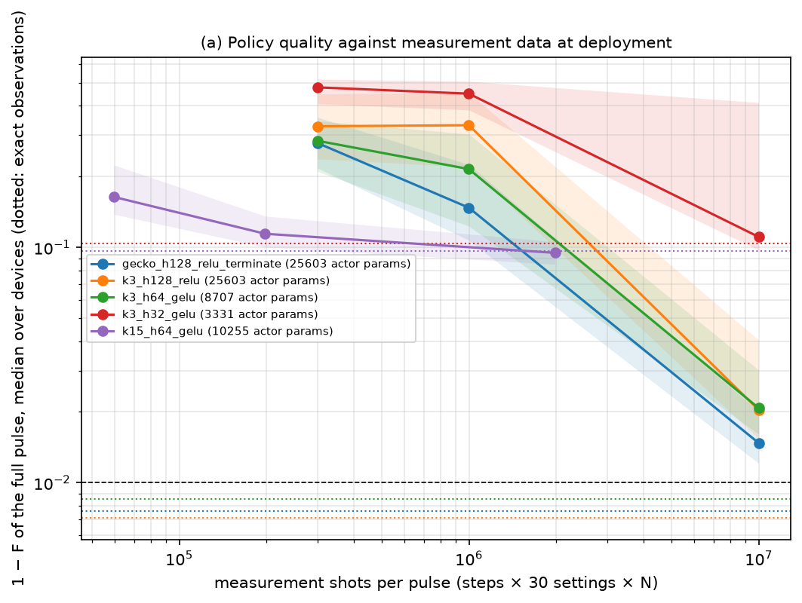
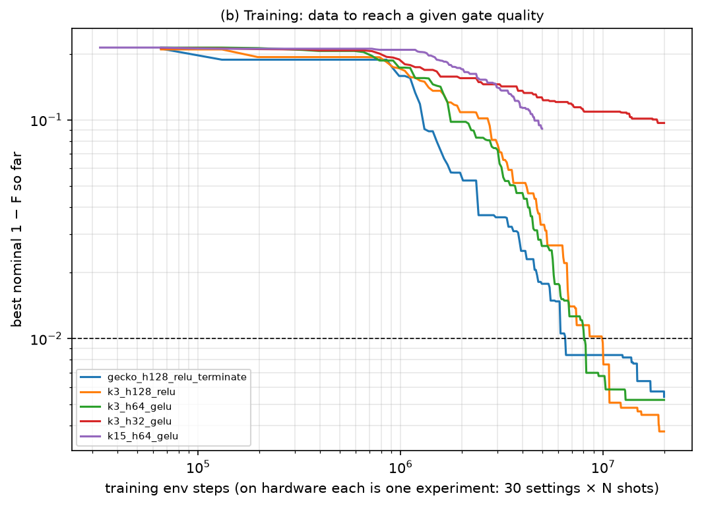
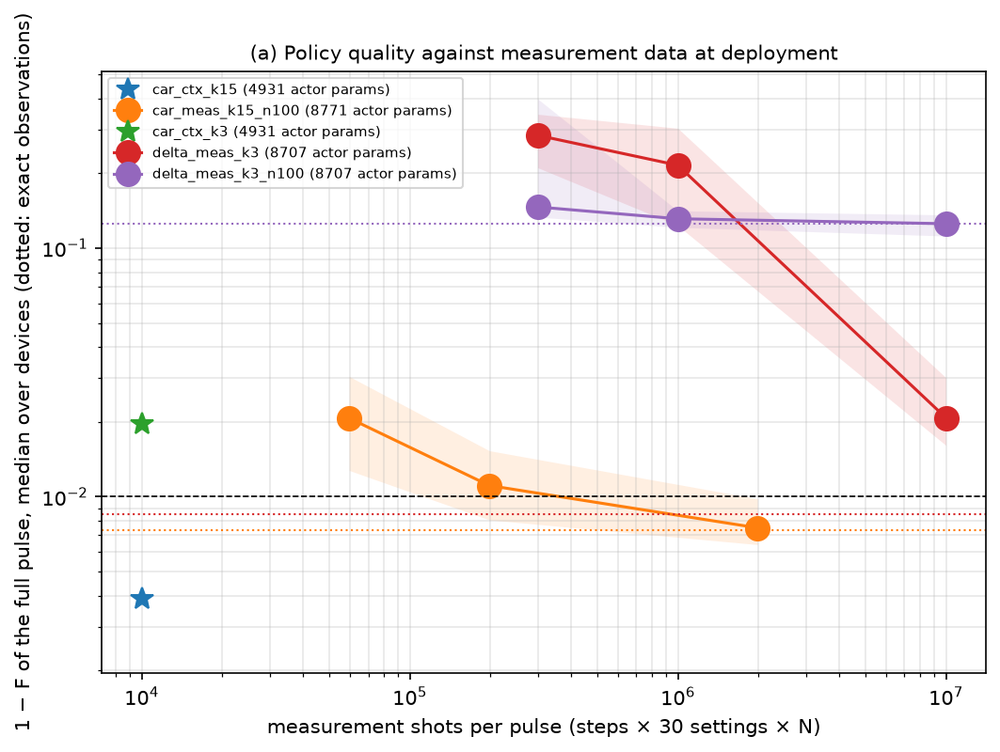
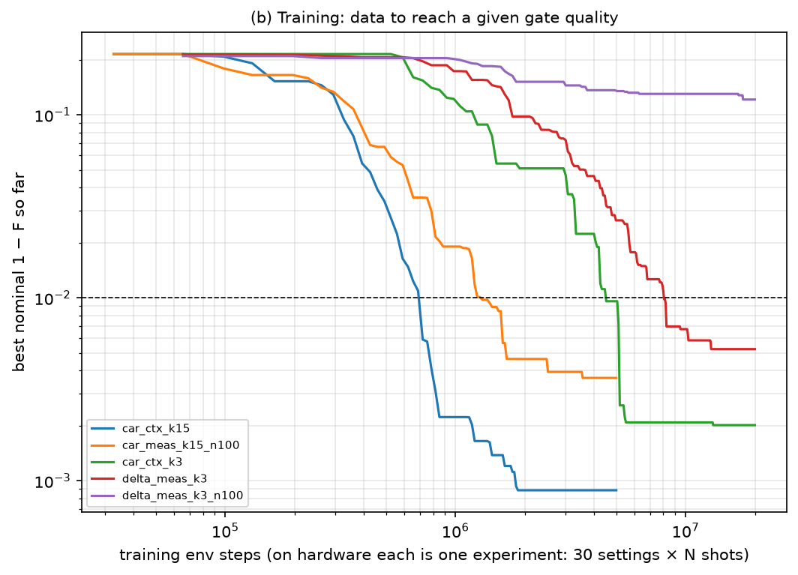

# 🦩 i09 ibis: gecko made data-lean

In progress. Runs in `runs/i09_ibis/`, records in `results/i09_ibis/`.

**Answer so far.** Yes, with the right action space. A policy that steers a carrier at the qubit
detuning (amplitude, phase, offset) and sees only a routine frequency calibration, measured once before
the pulse, plays the whole pulse open loop and reaches **1 − F = 3.9e-3** (median; all 24 drifted devices
below 1e-2) with about **1e4 shots per device**. It learns 11× faster than the best closed-loop policy and
beats it, even when that one gets exact observations. See [the carrier](#the-carrier-steer-slow-knobs-not-samples).

**Question.** Can everything be done, if necessary, on a real machine with its own observables, using as
little data as possible? Concretely: how few measurement shots per pulse and how small a policy network
still give a good gate under the large coupler drift (qubits ±5.7 MHz, coupler ±140 MHz), with the
√iSWAP fidelity of [gecko](gecko.md)?

## Design

| Ingredient | What it does | Flag |
| --- | --- | --- |
| Clip instead of terminate | An amplitude beyond ±20 rad/ns is clipped and costs `oob_penalty` per unit of excess; the episode goes on, so the policy never loses its pulse (gecko's two failed devices) | `--oob-mode clip --oob-penalty λ` |
| Finite shots | Each observed value is estimated from *N* shots per measurement setting (multinomial over the readout outcomes); one step costs 30 settings, i.e. 30 *N* shots | `--shots N` |
| Smaller networks, GELU | Hidden widths and activation | `--hidden 64 64 --activation gelu` |
| Longer steps | *K* samples per step (fewer, longer steps: fewer experiments per episode); the per-sample action scale must shrink with *K* | `--n-time-steps 15 --delta-scale 4` |
| Calibration context | The policy sees the qubit and coupler frequency offsets, measured once before the pulse (spectroscopy, error 0.1 / 0.1 / 1 MHz), with or without the measured observables | `--obs-mode context` / `measured+context` |
| Fidelity from measured data | The √iSWAP fidelity (free Z) reconstructed from the 30 settings alone: magnitudes from populations, phases from Pauli expectations; no Hamiltonian | `metrics.fidelity_from_observables` |
| Model-free refinement | SPSA and CMA-ES on that estimate, every shot counted | `rlquantopt/jx/refine.py` |
| Carrier action | u(t) = offset + A cos(2π f_d t + φ); the policy nudges (A, φ, offset); f_d = nominal qubit detuning, corrected by the measured calibration | `--action-mode carrier` |

The quality of a policy is now the **full pulse** (the last step). Cutting the pulse at its best step,
as in gecko, needs the exact fidelity, which a lab does not have.

## Results so far

### Policies trained on exact observations, deployed with finite shots

`scripts/ibis_eval.py`: the same 24 held-out devices as gecko, 1 − F of the full pulse, median over
devices (3 noise draws per device), for *N* shots per setting at deployment.

| Policy | Actor params | Exact | *N* = 1000 (1e7 shots/pulse) | *N* = 100 (1e6) | *N* = 30 (3e5) | Env steps to 1e-2 |
| --- | --- | --- | --- | --- | --- | --- |
| gecko: 128×128 ReLU, terminate | 26k | 7.6e-3 | 1.5e-2 | 1.5e-1 | 2.8e-1 | 6.6M |
| 128×128 ReLU, clip λ = 1 | 26k | 7.1e-3 | 2.0e-2 | 3.3e-1 | 3.3e-1 | 9.9M |
| **64×64 GELU, clip λ = 1** | **8.7k** | 8.5e-3 | 2.1e-2 | 2.2e-1 | 2.8e-1 | **8.1M** |
| 32×32 GELU, clip λ = 1 | 3.3k | 1.0e-1 | 1.1e-1 | 4.5e-1 | 4.8e-1 | never |
| *K* = 15, 64×64 GELU (5M steps) | 8.7k | 9.7e-2 | 9.5e-2 | 1.1e-1 | 1.6e-1 | never |

1. **Closed-loop policies trained on exact data do not survive shot noise.** At 1e6 shots per pulse
   they are 30× worse: they react to each of 333 noisy observations and the errors compound.
2. **64×64 GELU matches 128×128 ReLU with a third of the actor parameters** and reaches 1e-2 in fewer
   steps than the clip-mode ReLU network; 32×32 is too small for this task.
3. **λ = 1 is too weak**: 5-9 % of the steps are still clipped with exact observations.
4. **Longer steps (*K* = 15) are robust to noise but poor** (about 0.1). With v1's per-sample action scale
   they did not learn at all (every exploration hit the bound, the agent settled on the identity);
   `--delta-scale 4` fixed that, but 5M steps were not enough.

### Refinement from measured data only

The fidelity estimate from the 30 measured settings equals the true fidelity on exact data (to the digits
printed, on GRAPE and random pulses: the neglected coupler coherences do not matter); with *N* = 1000 it
resolves infidelities down to about 5e-4 (spread ±4e-4, a small upward bias).

But black-box refinement of a policy pulse barely moves it. Noise-free, 1500 fidelity estimates:

| Correction basis | Start | CMA-ES | SPSA |
| --- | --- | --- | --- |
| 3 physical knobs (offset, AC scale, ramp) + 8 sine modes | 5.8e-3 | 4.0e-3 | 5.3e-3 |
| 24 sine modes (≤ 0.24 GHz) | 5.8e-3 | 4.3e-3 | 5.0e-3 |
| 100 sine modes (≤ 1 GHz) | 5.8e-3 | 3.7e-3 | 4.5e-3 |

(one device; a second one gives the same picture). With *N* = 1000 shots it is worse. GRAPE reaches 1e-8
from the same pulses because it gets the exact gradient in all 999 samples at every step; a black-box
optimiser has to discover that information one noisy fidelity at a time. The gradient is not the issue:
57-81 % of its power sits below 0.25 GHz, inside the bases above. **So the policy must be good enough on
its own**, which is what the current runs address.

### The carrier: steer slow knobs, not samples

The calibration-only policy above could not learn with per-sample actions: it sat at the identity gate
(0.22) for 20M steps, whatever the penalty. A good pulse rides on a carrier near the qubit-qubit detuning,
about 0.86 GHz (43 periods in 50 ns); a closed-loop policy can pick up that rhythm from the rotating state
it observes, but an open-loop policy sees only a clock and cannot synthesise 43 oscillations from it.
Giving it the carrier, as a lab drives a gate, fixes this: the action nudges the amplitude, phase and
offset of u(t) = offset + A cos(2π f_d t + φ). Four constant knobs alone already reach 1.9e-3 at 50 ns,
so shaping them over time has room below 1e-3.

All 64×64 GELU, clip λ = 1; 24 drifted devices, full pulse:

| Policy | Shots per device | 1 − F median [quartiles] | Below 1e-2 | Env steps to 1e-2 (nominal) |
| --- | --- | --- | --- | --- |
| **Carrier, calibration only, *K* = 15 (open loop)** | **1e4** (calibration) | **3.9e-3** [2.5e-3, 4.4e-3] | **100 %** | **0.72M** |
| Carrier, calibration only, *K* = 3 | 1e4 | 2.0e-2 [7.5e-3, 1.0e-1] | 38 % | 4.5M |
| Carrier, measured, trained with *N* = 100, *K* = 15 | 2e6 (*N* = 1000) / 2e5 (*N* = 100) / 6e4 (*N* = 30) | 7.5e-3 / 1.1e-2 / 2.1e-2 | 81 % / 42 % / 11 % | 1.3M |
| Carrier, measured, *K* = 3 (exact or *N* = 100) | | stuck at 0.21 | 0 % | never |
| Per-sample, measured, exact-trained, *K* = 3 (the best before) | 1e7 (*N* = 1000) | 8.5e-3 exact, 2.1e-2 at *N* = 1000 | 75 % exact, 3 % at *N* = 1000 | 8.1M |
| Per-sample, measured, trained with *N* = 100, *K* = 3 | 1e6 (*N* = 100) | 1.3e-1 | 0 % | never |

1. **The open-loop carrier policy is the best on every axis**: lower infidelity than the best closed-loop
   policy with exact observations, about 1000× fewer shots than a closed-loop policy at *N* = 1000, and 11×
   fewer training steps. The calibration it needs (qubit and coupler frequencies, with 0.1 / 0.1 / 1 MHz
   errors) is what a lab measures routinely; it does not need the Hamiltonian.
2. **With the carrier, closed loop with shot noise works too**: 1.1e-2 at 2e5 shots per pulse, 20× better
   than the per-sample policy trained with the same noise.
3. **Few, long steps matter in carrier mode**: *K* = 3 (333 small knob decisions) learns badly or not at
   all; *K* = 15 (66 decisions) learns within 1M steps.

### Running

| Run | Question | Status |
| --- | --- | --- |
Nothing is running. Per-sample runs that finished since the first table: trained with *N* = 100,
*K* = 3 and *K* = 15: robust to noise but plateau at 0.13-0.14; calibration only (λ = 5 and λ = 1): stuck
at the identity (0.22), which the carrier fixes; calibration + measured (λ = 1): 0.13, and fragile under
noise.

## Next

1. Stress the calibration: larger frequency errors at deployment than in training, and drift that
   the calibration does not capture (couplings, anharmonicities).
2. More seeds for the carrier runs; *K* = 30 and 60 (even fewer decisions).
3. Smaller carrier policies (32×32); the calibration-only policy has 4.9k actor parameters.
4. A reward on the final pulse only, so that training on hardware needs one fidelity estimate per episode.
