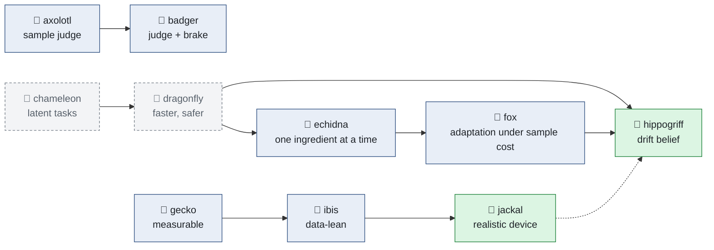

# The idea farm

Every new training idea gets a number and an animal codename, in alphabetical order, its own run
directory (`runs/iNN_<animal>/`, via `train.py --idea <animal>`), and a compact record in
`results/iNN_<animal>/` built by `scripts/idea_records.py`. The registry is
`rlquantopt/jx/ideas.py`; the code of each idea is walked through in
[Research agents](../code/idea-agents.md). These pages go through what each idea was, how it was tested
and what came out, including what did not work.

!!! note "Work in progress"
    These are working notes of exploratory research. Most ideas here did not beat the baseline; that is
    recorded as it happened. The lessons at the end of this page are what the farm is for.

## Status at a glance

Every animal carries a stamp, on its page and next to its emoji in the navigation:

| Stamp | Meaning | Animals |
| --- | --- | --- |
| <span class="stamp stamp--active">🟢 active</span> | In development: runs or analysis ongoing, conclusions may change | 🦄 hippogriff, 🐺 jackal |
| <span class="stamp stamp--concluded">🏁 concluded</span> | Tested to the end; the answer is recorded, positive or negative | 🐸 axolotl, 🦡 badger, 🦔 echidna, 🦊 fox, 🦎 gecko, 🦩 ibis |
| <span class="stamp stamp--archived">📦 archived</span> | Stopped at the smoke-test stage and superseded; kept for the record | 🐲 chameleon, 🦋 dragonfly |

Raw runs of closed experiments (failed ideas whose lessons are recorded here, an invalid benchmark, exact
duplicates) are moved to `runs/_attic/`, keeping only each run's best and final checkpoint; the records in
`results/` still build from them, and TensorBoard no longer shows them.

## The baseline every idea is measured against

Plain PPO on the gate environment ([training results](../results/training.md)): 64 environments ×
128 steps per update, 10 epochs × 32 minibatches, clip 0.2, GAE (0.99, 0.95), separate 2 × 128 ReLU
actor and critic, 20M steps (about 1.3 h). Over four seeds its best \(J_T\) is 1.1e-4 to 9.8e-4.
From gecko on, the baseline is the same PPO on the √iSWAP fidelity, and from ibis on the measure is the
full pulse on 24 held-out drifted devices.

## The animals

| | Status | Idea | What it changes | Tested on | Outcome |
| --- | --- | --- | --- | --- | --- |
| 🐸 | <span class="stamp stamp--concluded">🏁</span> | [i01 axolotl](axolotl.md) | a judge that reweights PPO's samples; actions emitted one delta at a time | gate env | worse than PPO |
| 🦡 | <span class="stamp stamp--concluded">🏁</span> | [i02 badger](badger.md) | axolotl's judge, better informed and fading; a KL brake on every update | gate env | stalled: the brake let through 2-7 % of the steps |
| 🐲 | <span class="stamp stamp--archived">📦</span> | [i03 chameleon](chameleon.md) | a latent world model sets tasks, the policy follows them | smoke test | too slow; its test episodes overshoot at once |
| 🦋 | <span class="stamp stamp--archived">📦</span> | [i04 dragonfly](dragonfly.md) | chameleon, faster, with a guided random-walk exploration, pessimism and a golden cache | smoke test | early gains, then degraded; two design flaws found |
| 🦔 | <span class="stamp stamp--concluded">🏁</span> | [i05 echidna](echidna.md) | PPO plus one dragonfly ingredient at a time, on toy environments first | toys, gate env | every ingredient is task-specific; none helps on the gate env |
| 🦊 | <span class="stamp stamp--concluded">🏁</span> | [i06 fox](fox.md) | adapting to a new device under a cost per sample, with an improvement-equivalent model | toy devices | no significant gain; not adapting is best there |
| 🦎 | <span class="stamp stamp--concluded">🏁</span> | [i07 gecko](gecko.md) | measurable observations and a hardware-reportable fidelity (parallel line of work) | gate env | the large-coupler-drift result holds: the policy's pulse + GRAPE reaches 1 − F ≤ 1e-3 on 92 % of devices, random starts 0 % at equal budget ([results](../results/measurable.md)) |
| 🦄 | <span class="stamp stamp--active">🟢</span> | [i08 hippogriff](hippogriff.md) | identify the device's drift with a belief whose uncertainty shrinks, then act on it | toy devices | 614-627 of the oracle's 655 in one episode (robust policy: 327); a linearised belief was overconfident, an exact grid belief fixes it. Next: the gate step on jackal's device |
| 🦩 | <span class="stamp stamp--concluded">🏁</span> | [i09 ibis](ibis.md) | gecko made data-lean: clipped amplitudes, finite shots, small networks, calibration context, refinement from measured data, **carrier actions** (parallel line of work) | gate env | an open-loop carrier policy fed only a frequency calibration (~1e4 shots per device) gives 1 − F = 3.7-4.6e-3 on every drifted device over 4 seeds, learned in 0.7-0.85M steps, robust to calibration errors 10× larger than in training and to unseen coupling and anharmonicity drift ([the new MDP](../system/carrier-mdp.md)); per-sample closed-loop policies fail under shot noise; black-box refinement barely helps |
| 🐺 | <span class="stamp stamp--active">🟢</span> | [i10 jackal](jackal.md) | the ibis calibration policy on a realistic device: no RWA, direct coupling, SQUID flux curve, AWG and filter, physical drift; train on the simplified model vs the full one | device model | first results (v2.20): trained on the simplified model, 1.1e-3 there but 3.7e-2 on the realistic device (a 35× sim-to-sim gap); trained on the realistic device, 7.2e-3 on drifted devices (75 % below 1e-2), about 5× from gradient-optimised knob schedules; unseen drift costs little. Next: close the 5× margin |

The emoji stand in where there is no emoji for the animal itself (🐸 axolotl, 🐲 chameleon, 🦋 dragonfly,
🦔 echidna, 🦄 hippogriff, 🦩 ibis, 🐺 jackal).

## How the ideas relate



Green: active; blue: concluded; grey, dashed: archived. The dotted edge is the next step: hippogriff's
identification on jackal's device model.

Two lines of work ran in parallel. The **algorithm line** (axolotl to hippogriff) asked what to add to PPO
to learn faster or adapt with fewer samples. The **problem line** (gecko to jackal) asked what the agent
should observe, what an action should be and what it must cost on hardware. The problem line produced the
largest gains; the algorithm line produced the identification machinery (hippogriff) and the
improvement-equivalence question (fox) that the next step combines with it.

## What the farm has taught

The lessons below are stated for reinforcement learning on real systems in general, where every sample is
an experiment, the plant drifts, and a simulator exists but is imperfect. The quantum gate is the test
case; the numbers come from the animals linked in each lesson.

### Design the decision problem before the learner

**1. The action space is the strongest lever.** No algorithmic add-on beat plain PPO (axolotl, badger,
echidna), but changing what an action *is* changed everything. With per-sample amplitude actions, an
open-loop policy stayed at the identity gate for 20M steps; steering three slow knobs of a carrier
(amplitude, phase, offset) instead, the same policy reached 1 − F = 1e-2 in 0.7-0.85M steps and
3.7-4.6e-3 on every held-out device, over four seeds ([ibis](ibis.md)). The carrier is the known structure of the solution; building it into
the action space is a prior no learner has to rediscover.
*For a real system:* act at the level of the physically meaningful knobs, on the timescale where decisions
matter, and put known structure (oscillations, set points, primitives) into the action parameterisation.

**2. Few, long decisions, but not too few.** In carrier mode, 333 decisions per episode learn badly or not
at all; 66 decisions reach 1e-2 in 0.72M steps (3.9e-3 on the devices); 33 decisions learn faster still
(0.46M steps) at a small cost in quality (5.2e-3); 16 decisions learn fastest (0.29M) but control too
coarsely (9.5e-3, a third of the devices above 1e-2) ([ibis](ibis.md)). Each decision is a credit-assignment
problem and, on hardware, possibly an experiment.
*For a real system:* use the coarsest decision interval that still controls what matters; the decision
count trades learning speed against the precision of control.

**3. Observe the task, not the state, when the state is expensive.** The pulse that works depends on the
device, and the device does not change during the pulse. A policy that sees only a routine calibration of
the device, measured once, plays the whole pulse open loop with about 1e4 shots per device; policies that
watch the evolving state need about 1e7 shots per pulse and, trained on exact observations, get 30× worse
at 1e6 shots because they react to every noisy reading ([ibis](ibis.md), [the new MDP](../system/carrier-mdp.md)).
The open-loop policy also holds up when its input is worse than in training: calibration errors 10×
larger cost little (4.2-5.1e-3, 92-99 % of devices below 1e-2), and drift it cannot see (couplings and
anharmonicities) costs less still; training with some unseen drift made it the most robust (94-100 % in every
stress case).
*For a real system:* if the uncertainty sits in a few parameters that are constant over an episode,
measure or identify those and condition on them (a contextual policy); pay for feedback only where it
changes the decision; train with the measurement noise you will deploy with; and randomise, in training,
what the context does not capture.

**4. Keep the episode alive; watch the conventions at episode ends.** Ending an episode at a constraint
violation throws away the whole pulse for one overshoot; clipping with a penalty keeps it ([ibis](ibis.md)).
Treating the violation as a truncation bootstraps γV onto the penalty: harmless when training from scratch,
but after a distribution shift an over-optimistic critic makes violating the constraint pay, and fine-tuning
collapses into it ([fox](fox.md)).
*For a real system:* audit what the learner is told at every episode end before trusting a fine-tuning
result.

### Identify, amortise, refine

**5. Identifying a few hidden parameters beats re-training many weights.** Black-box PPO fine-tuning on a
drifted device recovered almost nothing in 60 updates, and not adapting at all scored best once samples
were charged ([fox](fox.md)). A policy conditioned on the drift, with the drift identified by a Bayesian
belief during operation, recovered 575-627 of an oracle's 655 in the first episode, against 327 for a
robust policy ([hippogriff](hippogriff.md)).
*For a real system:* randomise the hidden parameters in simulation, condition the policy on them, and
spend the real samples on identification, not on gradient steps.

**6. A shrinking uncertainty is not a correct one.** A linearised Kalman belief shrinks by construction; on
a strongly nonlinear measurement it shrank around a wrong value and became hundreds of times overconfident.
An exact grid belief fixed it and is robust to noise and to a learned measurement model; a consistency check
(covariance inflation on surprising measurements) helps only when the model is exact ([hippogriff](hippogriff.md)).
*For a real system:* check calibration (normalised innovations, coverage), not just the width of the
posterior; prefer sampling or grid beliefs when the measurement is nonlinear.

**7. Amortise over the distribution, then refine with a model.** A policy trained once over the drift gives
each new device a warm start; a few hundred steps of a model-based optimiser (GRAPE) finish it. From the
policy's pulse 92 % of devices reach 1 − F ≤ 1e-3 within 200-500 steps, from random starts at the same gate
time and budget none do; the training pays back after tens to hundreds of devices
([gecko](../results/measurable.md), [RL-initialised control](../hypothesis/rl-initialised-qoc.md)).
*For a real system:* treat the policy as the first guess of an optimiser, and count the total cost,
training included, against re-optimising every time; and train on the most faithful model available: a
policy that reached 1.1e-3 on a simplified device model was 35× worse on the realistic one, where training
on the realistic model gave 7.2e-3 ([jackal](jackal.md)).

**8. Without a model, the last mile is expensive.** Refining a policy pulse from noisy fidelity estimates
alone (SPSA, CMA-ES) moved it from 5.8e-3 to about 4e-3 after 1500 noise-free estimates, where exact
gradients reach 1e-8 ([ibis](ibis.md)). A scalar evaluation carries one number's worth of information about
a 1000-dimensional pulse.
*For a real system:* if only noisy scalar feedback is available, most of the quality must come from the
amortised policy, and any on-line refinement should work in a few well-chosen dimensions.

### How to test ideas

**9. The bottleneck decides which ingredient helps.** Correlated exploration noise solves a sparse-reward
exploration trap and hurts precise tracking; self-imitation wins on precise tracking and loses on the
exploration trap, and on the gate environment it locked in early because the untrained critic undervalues
everything ([echidna](echidna.md)). The gate environment has a dense reward and is limited by precision, not
exploration, and it needs PPO's large steps: a KL brake stalled learning ([badger](badger.md)).
*For a real system:* diagnose whether the task is exploration-, precision- or credit-limited before adding
machinery for any of them.

**10. Test one ingredient at a time, on cheap proxies, with a control on the same code path.** The toy
environments caught two benchmark bugs (the truncation bootstrap, and a reward that made ending early
optimal) before they could mislead a long run ([fox](fox.md)); seeds of plain PPO differ by 9× in best
\(J_T\), so single-seed differences between variants mean little ([training](../results/training.md)). And
check that the evaluation runs on the system you think it does: jackal's periodic evaluation silently used
the old model's qubit frequencies, which made working policies look broken and picked the wrong checkpoints
until an independent check of what the action space could reach exposed it ([jackal](jackal.md)).

**11. Representation before capacity.** With the right observation and action space, a 32 × 32 GELU actor
of 1.4k parameters does as well as 64 × 64 (4.3e-3 against 3.9e-3 on the devices); with the wrong ones, no
size helped: a 32 × 32 closed-loop policy with per-sample actions stayed near 0.1 ([ibis](ibis.md)).

**12. Count what the real system charges.** Samples as shots or experiments, compute as core-hours, training
amortised over the devices it serves, and comparisons at matched gate time and budget: a warm start that
runs longer than its baseline could simply be buying time, and only the matched control showed it was not
([robustness](../results/robustness.md#the-gate-time-confound-and-its-control)).

## Why quantum control is a good test bed

Three properties make this problem a good place to develop sample-efficient RL for uncertain environments,
and each carries over to other physical systems:

- **An exact, differentiable model exists in simulation.** GRAPE differentiates through the simulator, so
  the best achievable pulse, the exact gradient and the exact improvement direction of any update are known.
  Every model-free result can be measured against that oracle, and a model-based refinement is always
  available to combine with it. Few real-world domains offer such a ground truth for checking what a
  learned model gets right.
- **The dynamics are complex and nonlinear.** The fidelity depends on the pulse and on the drift through
  interfering multi-level dynamics; a linearised model is confidently wrong ([hippogriff](hippogriff.md)) and a
  local optimiser needs a good start (random GRAPE starts need about 1000 steps where the policy's pulse
  needs 100-200). Neither a pure model-based nor a pure model-free method is enough, which is the case for
  combining them.
- **Uncertainty is structured and samples are expensive.** A handful of physical parameters drift, a lab
  measures some of them routinely, and every observation of the device costs shots and time. That is the
  regime of contextual policies, identification and tracking, where sample efficiency is the only metric
  that matters.

## Where next: tracking with improvement equivalence

**Tracking** means keeping a drifting system at its optimum with as few real samples as possible. The farm
points to a combination of model-based and model-free parts:

| Part | Role | Where it came from |
| --- | --- | --- |
| A policy trained over the drift distribution, conditioned on what can be measured | The amortised first guess, open loop | [ibis](ibis.md), [jackal](jackal.md) |
| A belief over the drift the calibration does not see, updated from measured outcomes | Identification across executions | [hippogriff](hippogriff.md) |
| A model-based improvement direction (gradients through the believed device) | Refinement where the model is trusted | GRAPE, [gecko](gecko.md) |
| A model of *which updates improve the return*, fitted to realised improvements | Search control: where the next real sample goes, how far to step, when to stop | [fox](fox.md) |

The last row is the **improvement equivalence principle**. A model need not predict the next state, nor
even the return; it only needs to agree with the real system on *which way, and by how much, an update
improves the return*. This extends the value-equivalence view of model-based RL, where a model only has to
reproduce the values that matter for planning [[grimm2020]](../bibliography.md#grimm2020), from values to
improvements. Used for **search control** (in the Dyna sense of deciding where planning and real samples
are spent [[sutton1990]](../bibliography.md#sutton1990)), it tells a tracker which direction to try next,
how much to trust the model there, and when another sample is no longer worth its cost. The principle is
preliminary; the formulation on these pages is a working version of it.

Fox was a first, small test: a Bayesian regression of realised return change on the direction of each PPO
step. It gave no significant gain (+5.5 ± 3.7 over plain fine-tuning), and riding along during hippogriff's
pretraining its predictions faded as training converged (correlation with the realised change 0.30-0.36 early,
negative late). What the farm suggests for the next version:

1. **Work in knob space, not weight space.** Fox modelled improvements in the actor's parameter space,
   where each direction is a mix of thousands of weights. The carrier policy has 3-5 physical knobs per
   decision, and a drifted device needs corrections to a few of them: a low-dimensional space where an
   improvement model can be fitted from a handful of measured fidelities.
2. **Calibrate it against the oracle.** In simulation, GRAPE's gradient is the exact improvement direction.
   An improvement-equivalent model can be checked against it (cosine and magnitude, per device), before it is
   trusted on measured data with shot noise.
3. **Use it where improvements are large and informative**: right after a drift or a recalibration, not near
   convergence, and stop by the marginal-value rule once the predicted gain falls below the cost of the
   shots.
4. **Measure the right thing**: shots spent per device-hour kept above the target fidelity, under drift
   that evolves in time ([platforms](../next/platforms.md#what-to-do-until-there-is-hardware)).

The immediate steps: bring jackal's policy on the realistic device from 7.2e-3 to the ~1e-3 its knobs can
reach, then hippogriff's identification of the drift the calibration cannot see (worth about 2× at that
level on this device), with the calibration policy as the amortised part.

## Reproducing

```bash
python -m rlquantopt.jx.train --idea <animal> --algo <algo> ...     # gate-env ideas (see each page)
python -m rlquantopt.jx.toybench --env tracker --variant sil          # echidna toy grid
python -m rlquantopt.jx.foxbench --seeds 3 --devices 8 --budget 60    # fox
python -m rlquantopt.jx.hippogriff --seed 0 --devices 12              # hippogriff
python scripts/ibis_eval.py --runs LABEL=RUN ...                      # ibis: 24 drifted devices, finite shots
python scripts/jackal_eval.py --runs LABEL=RUN ...                    # jackal: deploy on the full device model
python scripts/idea_records.py                                        # rebuild results/iNN_<animal>/
```
