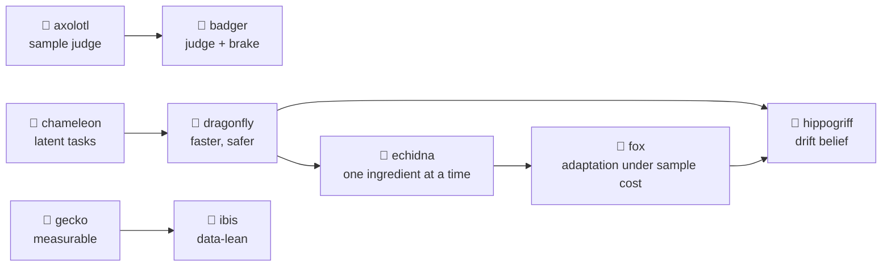

# The idea farm

Every new training idea gets a number and an animal codename, in alphabetical order, its own run
directory (`runs/iNN_<animal>/`, via `train.py --idea <animal>`), and a compact record in
`results/iNN_<animal>/` built by `scripts/idea_records.py`. The registry is
`rlquantopt/jx/ideas.py`. These pages go through what each idea was, how it was tested and what came
out, including what did not work.

!!! note "Work in progress"
    These are working notes of exploratory research. Most ideas here did not beat the baseline; that is
    recorded as it happened.

## The baseline every idea is measured against

Plain PPO on the gate environment ([training results](../results/training.md)): 64 environments ×
128 steps per update, 10 epochs × 32 minibatches, clip 0.2, GAE (0.99, 0.95), separate 2 × 128 ReLU
actor and critic, 20M steps (about 1.3 h). Over four seeds its best \(J_T\) is 1.1e-4 to 9.8e-4.

## The animals

| | Idea | What it changes | Tested on | Outcome |
| --- | --- | --- | --- | --- |
| 🐸 | [i01 axolotl](axolotl.md) | a judge that reweights PPO's samples; actions emitted one delta at a time | gate env | worse than PPO |
| 🦡 | [i02 badger](badger.md) | axolotl's judge, better informed and fading; a KL brake on every update | gate env | stalled: the brake let through 2-7 % of the steps |
| 🐲 | [i03 chameleon](chameleon.md) | a latent world model sets tasks, the policy follows them | smoke test | too slow; its test episodes overshoot at once |
| 🦋 | [i04 dragonfly](dragonfly.md) | chameleon, faster, with a guided random-walk exploration, pessimism and a golden cache | smoke test | early gains, then degraded; two design flaws found |
| 🦔 | [i05 echidna](echidna.md) | PPO plus one dragonfly ingredient at a time, on toy environments first | toys, gate env | every ingredient is task-specific; none helps on the gate env |
| 🦊 | [i06 fox](fox.md) | adapting to a new device under a cost per sample, with an improvement-equivalent model | toy devices | no significant gain; not adapting is best there |
| 🦎 | [i07 gecko](gecko.md) | measurable observations and a hardware-reportable fidelity (parallel line of work) | gate env | the large-coupler-drift result holds: the policy's pulse + GRAPE reaches 1 − F ≤ 1e-3 on 92 % of devices, random starts 0 % at equal budget ([results](../results/measurable.md)) |
| 🦄 | [i08 hippogriff](hippogriff.md) | identify the device's drift with a belief whose uncertainty shrinks, then act on it | toy devices | 614 of the oracle's 655 in one episode (robust policy: 327); the belief is overconfident |
| 🦩 | [i09 ibis](ibis.md) | gecko made data-lean: clipped amplitudes, finite shots, small networks, calibration context, refinement from measured data (parallel line of work) | gate env | in progress: exact-trained policies fail under shot noise; black-box refinement barely helps; 64×64 GELU matches 128×128 ReLU |

The emoji stand in where there is no emoji for the animal itself (🐸 axolotl, 🐲 chameleon, 🦋 dragonfly,
🦔 echidna, 🦄 hippogriff, 🦩 ibis).

## How the ideas relate



## What the farm has taught so far

1. **This environment is not exploration-limited.** Its reward is dense (\(-\log_{10} J_T\) every step)
   and the right region of pulse space is found quickly. What limits RL is precision and not overshooting
   the amplitude bound. Exploration ideas (chameleon's orthogonal tasks, dragonfly's walk, echidna's
   correlated noise) do not transfer; correlated noise even hurts precise tracking.
2. **PPO needs its large steps here.** A KL brake that makes updates gentle (badger) stops learning.
3. **Ingredients are task-specific.** On the toys, self-imitation wins where precision matters and
   loses where exploration matters; correlated noise is the mirror image (echidna).
4. **Knowing the device beats re-training on it.** Black-box fine-tuning after drift barely recovers
   (fox); a policy conditioned on the drift, with the drift identified by a Bayesian filter, recovers most
   of the oracle's return within one episode, and probing for information adds more the noisier the
   measurements (hippogriff).
5. **Test ingredients in isolation, on cheap environments first.** Two benchmark bugs (a truncation
   bootstrap that paid for overshooting after drift, and a reward that made dying early optimal) were
   caught this way before they could mislead a long run.
6. **A shrinking uncertainty is not a correct one.** A linearised Kalman belief shrinks by construction,
   even around a wrong estimate; on a strongly nonlinear measurement it became 9-890× overconfident
   (hippogriff). Uncertainty needs a consistency check, or a filter that does not linearise.

## Reproducing

```bash
python -m rlquantopt.jx.train --idea <animal> --algo <algo> ...     # gate-env ideas (see each page)
python -m rlquantopt.jx.toybench --env tracker --variant sil          # echidna toy grid
python -m rlquantopt.jx.foxbench --seeds 3 --devices 8 --budget 60    # fox
python -m rlquantopt.jx.hippogriff --seed 0 --devices 12              # hippogriff
python scripts/idea_records.py                                        # rebuild results/iNN_<animal>/
```
