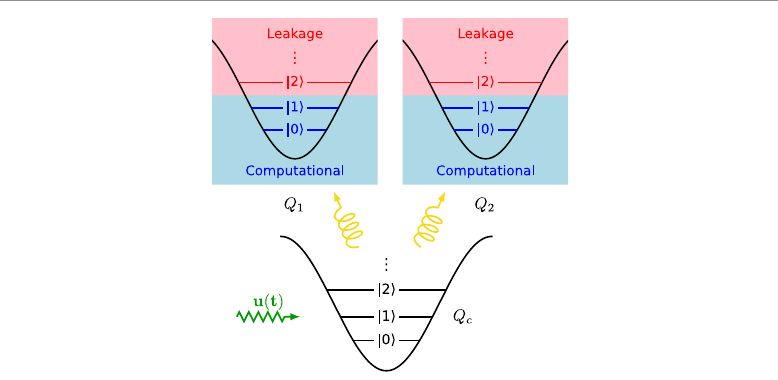
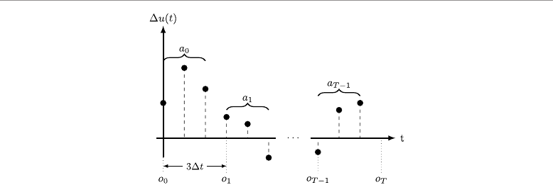
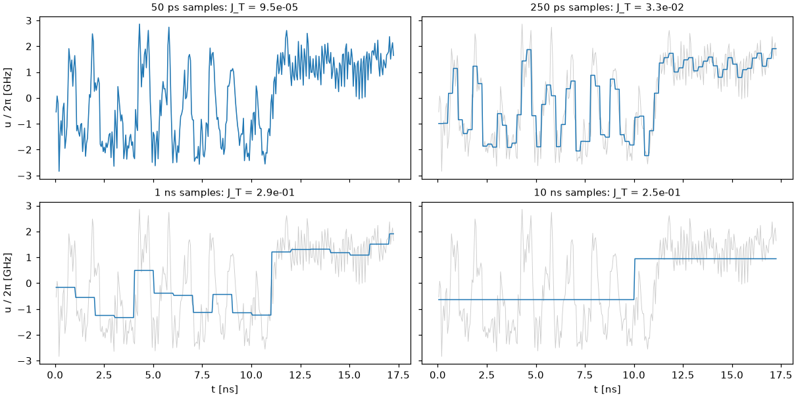
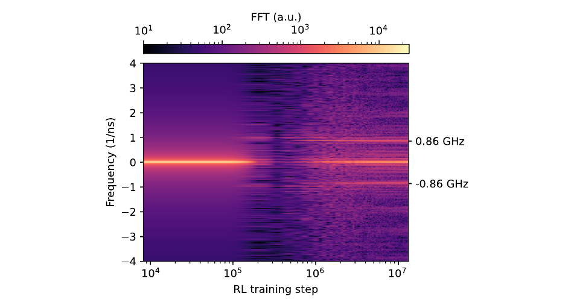

---
hide:
  - navigation
  - toc
---

# RLQuantOpt

Reinforcement learning that shapes the control pulses of superconducting quantum computers,
fast enough to track a drifting device.

[Collaborate with us :material-handshake:](contact.md){ .md-button .md-button--primary }
[Read the paper :material-file-document-outline:](https://doi.org/10.1088/2058-9565/ae2c16){ .md-button }
[Code :material-github:](https://github.com/leandergrech/rlquantopt){ .md-button }

!!! warning "Work in progress: open-source active research"
    This is ongoing research by Leander Grech, shared openly as it happens. Code, results and
    conclusions may change; the settled results are those of the published paper
    [[grech2026]](bibliography.md#grech2026).

-   :material-lightning-bolt:{ .lg } **~10 ns entangling gates**

    An RL agent finds a perfect-entangling pulse at the quantum speed limit of the model.

-   :material-speedometer:{ .lg } **~100× faster simulation**

    v2 in JAX: exact, differentiable, ~40k environment steps/s on a laptop CPU.

-   :material-target:{ .lg } **Hardware drift built in**

    Robustness scored against measured drift of real transmons, from hours to new devices.

-   :material-tune-variant:{ .lg } **A gate from one calibration**

    A policy that reads only a routine frequency calibration (~1e4 shots) plays a √iSWAP pulse open
    loop on every drifted device. [The new MDP](system/carrier-mdp.md)

-   :material-sprout:{ .lg } **An idea farm for sample-efficient RL**

    Ten ideas, each with a codename, a status stamp and the lessons it taught.
    [The farm](ideas/index.md)

-   :material-handshake-outline:{ .lg } **Looking for hardware time**

    We want to test RL-controlled pulses on a real device. [Get in touch](contact.md).

## The idea

RLQuantOpt is a curiosity-driven research effort. The question: can an agent that learns from
trial and error design the microwave-scale control pulses of a quantum processor as well as,
or better than, gradient-based optimal control, while adapting when the hardware drifts?

In simulation, the answer so far is encouraging. An RL agent found a two-qubit perfect-entangling
gate in about 10 ns, matching the speed limit found by optimal control
[[grech2026]](bibliography.md#grech2026). Its pulses can be refined further by gradient methods,
and a policy can re-generate pulses for a slightly different device without re-optimisation.

Since then the work has turned to what a real device demands: only measurable observations, a gate
fidelity a lab reports, finite measurement shots, and as few experiments as possible. The current policies
read a routine calibration of the device and play a whole pulse without measuring anything during it
([The calibration policy](system/carrier-mdp.md)), and a series of research ideas asks, more generally,
what makes reinforcement learning sample-efficient on real, drifting systems ([the idea farm](ideas/index.md)).

**Our outstanding goal is hardware.** We are looking for collaborators who can provide time on a
superconducting quantum processor, to test RL-generated pulses on a real device and to study how
RL can make calibration faster and the use of scarce hardware time more efficient.
[Get in touch](contact.md).

## How it works (v1, the published design)

!!! info "Since v2.18: a calibration policy"
    The current policies no longer watch the quantum state. They read a routine frequency calibration
    of the device and steer a carrier pulse open loop: see
    [The calibration policy (new MDP)](system/carrier-mdp.md).

<figure markdown>
  { width="560" }
  <figcaption markdown="span">Two fixed-frequency transmons, Q1 and Q2, coupled through a tunable bus Qc whose
  frequency is modulated by the control u(t). Each is modelled with three levels; population above
  |1⟩ is leakage. Figure 1 of [[grech2026]](bibliography.md#grech2026), CC BY 4.0.</figcaption>
</figure>

Modulating the bus at the qubit-qubit detuning (0.86 GHz) activates an iSWAP-type interaction,
the parametric scheme demonstrated experimentally by [[mckay2016]](bibliography.md#mckay2016).
The agent does not set the pulse amplitude directly. At each step it proposes three amplitude
**changes**, each held for 50 ps, which are added to the previous amplitude:

<figure markdown>
  { width="560" }
  <figcaption markdown="span">The agent's action is a vector of pulse deltas Δu, applied over 3 × 50 ps; it observes
  the quantum state after each segment. Figure 2 of [[grech2026]](bibliography.md#grech2026), CC BY 4.0.</figcaption>
</figure>

### Why fine, delta-parameterised pulses

Earlier RL pulse design used piecewise-constant pulses sampled every 10 ns, about 50 MHz of
bandwidth, which cannot represent the GHz-scale features a transmon gate needs
([[grech2026]](bibliography.md#grech2026), section 1.1). v1 samples every 50 ps and lets the agent
move the amplitude in bounded steps, which keeps the pulse continuous-looking and its slew rate
limited. The difference is not cosmetic. Re-sampling the paper's RL pulse more coarsely, with the
same simulator:

| Sampling of the same pulse | J_T at 17.25 ns |
| --- | --- |
| 50 ps (v1) | 9.5e-5 |
| 250 ps | 3.3e-2 |
| 1 ns | 2.9e-1 |
| 10 ns | 2.5e-1 (no entangling gate) |

(Coarsening a pulse optimised at 50 ps is harsher than optimising at a coarse sampling from the
start; the point is that the gate relies on sub-nanosecond structure.)

<figure markdown>
  { width="460" }
  <figcaption markdown="span">During training the agent discovers the 0.86 GHz qubit-qubit detuning as the pulse's
  main frequency. Figure 5 of [[grech2026]](bibliography.md#grech2026), CC BY 4.0.</figcaption>
</figure>

### How it compares

| | Gate | Time | Fidelity or error | Setting |
| --- | --- | --- | --- | --- |
| This project (v1 RL pulse) | perfect entangler | 17 ns | J_T = 9.5e-5 | simulation, closed system |
| Parametric iSWAP on a tunable bus [[mckay2016]](bibliography.md#mckay2016) | iSWAP | 183 ns | 98.2 % | experiment |
| Tunable coupler, CZ / iSWAP [[sung2021]](bibliography.md#sung2021) | CZ, iSWAP | — | 99.76 % / 99.87 % | experiment |
| Double-transmon coupler, RL-optimised [[li2024]](bibliography.md#li2024) | CZ | — | 99.90 % | experiment |

The simulated number is not comparable to the experimental ones: it has no decoherence, an
idealised control line and a perfect-entangler target rather than a named gate. Closing that gap is
exactly what hardware collaboration is for.

## Current simplifications

The paper's model is idealised. Where each simplification stands:

| Simplification in the paper's model | Status |
| --- | --- |
| Perfect-entangler target, not a named gate | **Removed** (v2.16): √iSWAP average gate fidelity with free virtual-Z corrections, leakage included ([Gate metrics](system/metrics.md#named-gate-fidelity-with-free-z-corrections)) |
| State amplitudes as observations (not measurable) | **Removed** (v2.16-v2.18): readout populations and Pauli expectations, finite shots, or only a frequency calibration ([the new MDP](system/carrier-mdp.md)) |
| RWA couplings, excitation number conserved | **Being removed** in the realistic device model: counter-rotating terms kept ([jackal](ideas/jackal.md), in progress) |
| Linear control u·b†b, no flux non-linearity | **Being removed**: the coupler is tuned through an asymmetric-SQUID flux curve, couplings scale with it (jackal) |
| Unbounded coupler excursion, no flux-line filter | **Being removed**: bounded flux, 1 ns AWG samples, a first-order flux-line filter (jackal) |
| Closed system, T1/T2 only at evaluation | Open |
| Two qubits, no spectators | Open |

Each is discussed, with what it would take to remove it, in
[Named gates and a richer model](next/named-gates.md).

## History and credits

- **v1 (2024-2025)**, the published work [[grech2026]](bibliography.md#grech2026): the ZCQPEE
  environment and TRPO agents. **Mirko Consiglio** carried out the mathematical and physical
  validation of v1, and **Matthias G. Krauss** validated it independently with separate Julia
  simulations.
- **v2 (from September 2026)**, this site: a JAX re-implementation that runs ~100× faster, is
  differentiable end to end, reproduces the paper, and adds gradient-based baselines and hardware
  drift models. Start with [Working together](working-together.md) or the
  [Model and simulator](system/model.md).
- **Since v2.16**: a named gate and measurable observations (gecko), data-lean calibration policies
  (ibis), a realistic tunable-coupler device (jackal), and the [idea farm](ideas/index.md) of research agents.
- **Next:** identifying the drift a calibration cannot see (hippogriff on jackal's device), tracking a
  drifting device with few samples, and **hardware**. [Collaborate with us](contact.md).

## What changed recently

!!! abstract "Latest"
    - **Docs consolidated** (v2.19): every idea carries a status stamp (🟢 active, 🏁 concluded,
      📦 archived); the idea farm states its lessons for sample-efficient RL on real systems and the next
      step, tracking with improvement equivalence ([the farm](ideas/index.md)); the code pages walk through
      PPO and every research agent ([Agents](code/agents.md), [Research agents](code/idea-agents.md)).
    - **Ibis concluded** (v2.19): the open-loop calibration policy holds over four seeds (1 − F = 3.7-4.6e-3
      on all 24 drifted devices), with a 1.4k-parameter network, with calibration errors 10× larger than in
      training (92-99 % of devices below 1e-2) and with drift the calibration cannot see; 33 decisions per
      pulse learn faster (0.46M steps) at 5.2e-3 ([ibis](ideas/ibis.md)).
    - **A realistic device** (jackal, in progress): no RWA, direct coupling, a SQUID-tuned coupler, 1 ns
      AWG and a flux-line filter, physical drift; does the calibration policy transfer from the simplified
      model? ([jackal](ideas/jackal.md))
    - **The calibration policy** (v2.18.0): a policy that sees only a frequency calibration, measured once,
      and steers the knobs of a carrier reaches 1 − F = 3.9e-3 on all 24 large-coupler-drift devices with
      about 1e4 shots per device, open loop, in 0.72M training steps ([the new MDP](system/carrier-mdp.md),
      [ibis](ideas/ibis.md)).
    - **Identifying the drift** (v2.18.1): a drift-conditioned policy with an exact Bayesian belief recovers
      575-627 of an oracle's 655 in the first episode on toy devices; a linearised belief was overconfident
      ([hippogriff](ideas/hippogriff.md)).

The full history is in the [changelog](changelog.md).
