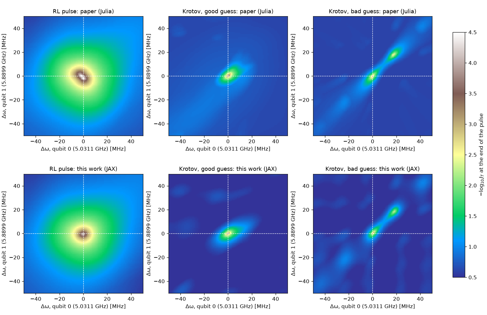
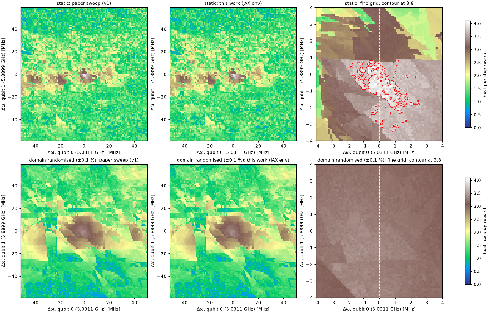
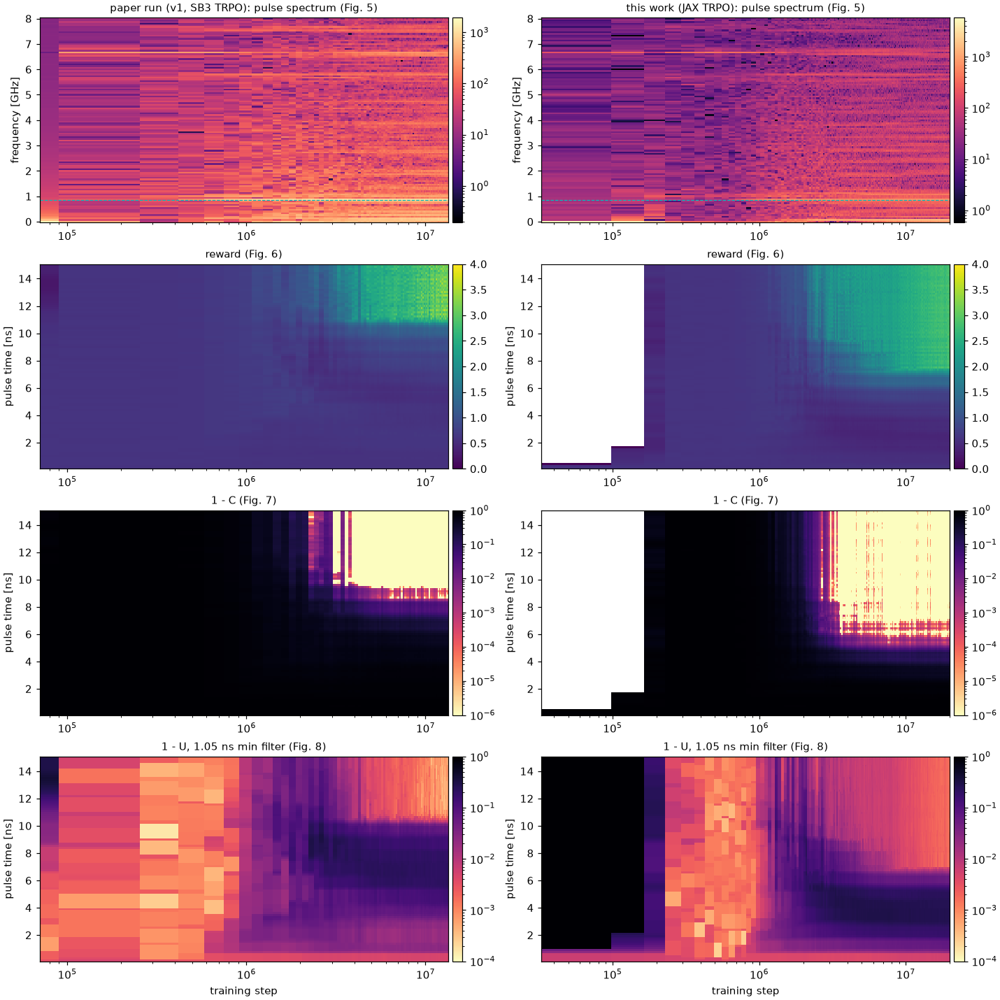
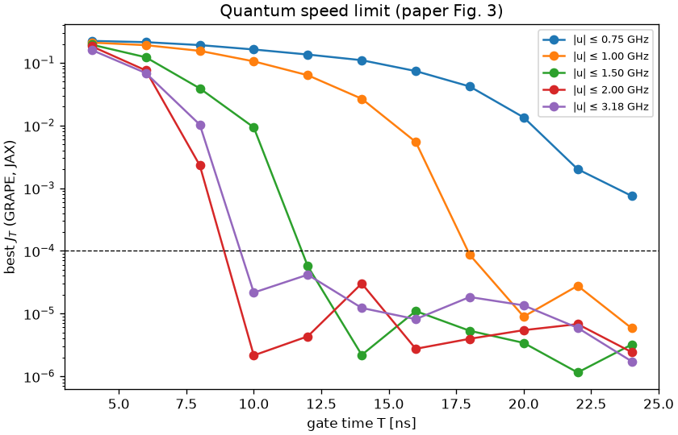

# Replicating Grech et al. (2026) with the JAX re-implementation

This report checks the results of *Achieving fast and robust perfect entangling gates via
reinforcement learning* (Quantum Sci. Technol. 11, 015030,
[doi:10.1088/2058-9565/ae2c16](https://doi.org/10.1088/2058-9565/ae2c16)) with the JAX code in
`rlquantopt/jx` (v2). Every number below can be regenerated with the scripts in `scripts/`.

**Summary.** The JAX environment reproduces the paper's physics exactly, and the paper's own
trained policies behave identically in it. The robustness maps and the generalisation sweeps are
reproduced. A fresh TRPO run with the paper's settings shows the same learning dynamics but, in
one seed, stops at J_T ≈ 1e-3 instead of 1e-4. GRAPE on the same simulator gives the speed limit.
Several places where the paper text and the code differ are listed at the end.

## Setup

| Item | Value |
| --- | --- |
| Hardware | Laptop, Intel i7 (16 threads), NVIDIA T550 (4 GB) |
| Software | JAX 0.7.1, Flax, Optax; float64 throughout |
| Reference code | v1 (`rlquantopt/rl_envs/zc_qpee.py`, SB3 2.3.1 / sb3-contrib TRPO) and the paper run `rl_agents/ZCQPEE_pl-1000_T-50ns_delta_mode-TRPO/05-12-24_201634` |
| Paper data used | `paper_plots/final_pulses/*.csv`, `paper_plots/robustness/*.jld2`, `rl_analysis/generalisation/*.json`, v1 training evaluations (`paper_plots/training_evals_v1.npz`) |

## 1. Simulator

The Hamiltonian conserves the total excitation number, so only a 3×3 (N = 1) and a 6×6 (N = 2)
block are propagated, each exactly with `eigh`. The realised gate is block-diagonal, which gives
the Weyl-chamber coordinates in closed form.

| Check (`tests/`) | Result |
| --- | --- |
| 27-dim Hamiltonian vs v1 `ZCQubits` | identical (1e-12) |
| Sector propagation vs full 27-dim `expm` | 1e-13 |
| Weyl coordinates, concurrence, unitarity vs `weylchamber` | 1e-8 |
| Step-by-step vs v1 `ZCQPEE` (random actions, full episodes) | within v1's float32 observations and ODE error (v1 drifts ~1e-8 from exact) |
| Environment throughput, float64 | ~40k steps/s on 16 CPU threads (v1: ~410/s including training) |
| TRPO with the paper's settings (4 envs × 2048) | 20M steps in 1 h 55 min (v1: ~9 h for 13.3M) |

float32 is not accurate enough: rounding over 1000 steps shifts J_T by ~1e-4, the scale the agent
optimises (the paper's RL pulse reads J_T_min = 8e-6 instead of 9.5e-5).

## 2. Stored pulses and robustness (Figs. 10-12)



`scripts/replicate_robustness.py` evaluates the stored pulses on the paper's ±50 MHz grid and
compares with the paper's Julia results.

| Pulse | J_T at nominal, this work | J_T at nominal, paper | Median \|Δlog10 J_T\| over the map |
| --- | --- | --- | --- |
| RL, stopped at 17.25 ns | 9.49e-5 | 9.63e-5 | 0.06 |
| Krotov, good guess | 9.88e-5 | 9.49e-5 | 0.26 |
| Krotov, bad guess | 1.43e-3 | 9.13e-5 | 0.11 |

The landscapes match: a broad basin for the RL pulse, a narrow band for the good-guess Krotov
pulse and two separate pockets for the bad-guess one. The bad-guess nominal value differs by
~15×; the Julia script is not in the repository, so the cause is open.

J_T of the RL pulse oscillates between ~1e-4 and ~1e-3 with a ~0.25 ns period, so where the
pulse is stopped matters. The paper's value matches only the best time, 17.25 ns.

## 3. The paper's policy in the JAX environment

`rlquantopt.jx.sb3_import` loads the paper's SB3 checkpoint (`rl_model_12566528_steps.zip`).
Run deterministically in the JAX environment, it regenerates the paper's RL pulse to within
6e-3 rad/ns up to 17.25 ns (|u| ≤ 20 rad/ns), with its best step at 17.25 ns and J_T = 9.49e-5,
as in the paper. The trajectories only separate after ~30 ns, where the closed loop amplifies
v1's ODE error.

## 4. Policy-level generalisation (Figs. 13-17)



`scripts/replicate_generalisation.py` runs the paper's static policy and its domain-randomised
(±0.1 %) policy on the paper's ±1 % grid (101 × 101) and compares with the v1 sweeps.

| Policy | Points within 0.1 reward of the v1 sweep | Max best-step reward |
| --- | --- | --- |
| Static (`rl_model_12566528`) | 100 % | 4.018 |
| Domain-randomised (`ZCQPEEWRD …/rl_model_19382272`) | 100 % | 3.406 |

The domain-randomised policy generalises over a wider region but its error floor stays above
1e-4 (reward < 4), as the paper reports. On a 0.1 MHz grid, the static policy's reward ≥ 3.8
island around nominal spans Δω0 ∈ [−0.8, 1.6] MHz and Δω1 ∈ [−2.0, 0.5] MHz (paper:
[−1.4, 1.6] and [−1.4, 0.6], read from a coarser grid).

## 5. Training from scratch (Figs. 5-8)



One TRPO run with the paper's hyper-parameters (seed 123, 20M steps; `results/jax_trpo_paper_s123/`).

| | Paper run (v1) | This work (JAX, 1 seed) |
| --- | --- | --- |
| Breakthrough (concurrence error collapses) | 2-4M steps | 2-4M steps |
| First perfect entangler (C = 1) | ~9 ns | ~6 ns |
| Dominant pulse frequency | 0.86 GHz | 0.86 GHz |
| Best J_T | 9.5e-5 at 17.25 ns (12.6M steps) | 9.8e-4 at 46.8 ns (19.9M steps) |
| 1 − U at the best step | 1.2e-4 | 1.3e-3 |

The learning dynamics match, and this agent entangles faster, but its best gate is ~10× worse
and limited by leakage, which was still falling at 20M steps. With one seed per implementation
it is not possible to tell seed variance from a systematic difference (for example, exact
propagation here vs v1's ODE error during training). Next step: 5 seeds each.

## 6. Quantum speed limit (Fig. 3)



`scripts/replicate_qsl.py` runs GRAPE on the same simulator (4 random smooth guesses, 1000 Adam
steps, best J_T kept) for several amplitude limits.

| Amplitude limit | Best J_T at 8 ns | at 10 ns | at 12 ns | Shortest T with J_T ≤ 1.5e-4 (2 ns grid) |
| --- | --- | --- | --- | --- |
| 0.75 GHz | 1.9e-1 | 1.6e-1 | 1.4e-1 | > 24 ns (7.5e-4 at 24 ns) |
| 1.0 GHz | 1.6e-1 | 1.1e-1 | 6.3e-2 | 18 ns |
| 1.5 GHz | 3.9e-2 | 9.3e-3 | 5.7e-5 | 12 ns |
| 2.0 GHz | 2.3e-3 | 2.2e-6 | 4.3e-6 | 10 ns |
| 3.18 GHz (RL limit) | 1.0e-2 | 2.2e-5 | 4.2e-5 | 10 ns |

The paper puts the QSL at 10 ns for a 1.5 GHz limit; here it lies between 10 and 12 ns, with a
2 ns grid and only four random restarts per point (the paper's Krotov/GRAPE runs started from
hand-designed guesses). The non-monotonic 3.18 GHz entry at 8 ns shows the restarts are too few
to certify the bound. For the RL agent's 3.18 GHz limit the gradient bound is ~8-10 ns, consistent
with the ~10 ns gates the RL agents find.

## 7. Where the paper and the code differ

| # | Paper | Code / data | Effect |
| --- | --- | --- | --- |
| 1 | Table 1 pairs ω1 = 5.8899 GHz with α1 = 324 MHz, g1 = 100 MHz | Code pairs α = −324 MHz, g = 100 MHz with ω = 5.0311 GHz | With the table's pairing all stored pulses fail (J_T 1e-2 to 6e-2); the code's is the one used |
| 2 | Activation not stated | Paper run used ReLU (tanh came in later, Jun 2025) | Needed to load or re-train the paper agent |
| 3 | Truncation penalty −10 | −20 · (1 − t/T) | Reward scale of failed episodes |
| 4 | TV penalty Σ over all K deltas (eq. 5) | Σ\|ΔA\| within the segment, i.e. only K − 1 deltas | Minor |
| 5 | Reward −log10(J_T) | Paper run also subtracts −log10(0.99) = 0.0044 per step | Negligible |
| 6 | Domain randomisation redraws ω each episode | v1 `ZCQPEEWRD` draws once per env instance: 8 fixed systems | The DR agent saw 8 detuned systems, not a distribution |
| 7 | Robustness uses the RL pulse | Exported `clip_best` pulse stops 3 samples early (best time taken as idx × 0.15 ns) | J_T 9.8e-4 instead of 9.5e-5 at nominal |
| 8 | — | The `qvaqt` conda env no longer runs v1 (qutip 5.0.2 with scipy 1.15.3) | Use `requirements-jax.txt`, which pins a working qutip |

## Reproduce

```bash
pip install -r requirements-jax.txt && pip install -e . --no-deps
pytest tests/
JAX_PLATFORMS=cpu python scripts/replicate_robustness.py
JAX_PLATFORMS=cpu python scripts/replicate_generalisation.py        # needs the v1 checkpoints
JAX_PLATFORMS=cpu python -m rlquantopt.jx.train --algo trpo --seed 123 --eval-every 65536 --tag paper
python scripts/replicate_training_figs.py runs/trpo_*_paper
JAX_PLATFORMS=cpu python scripts/replicate_qsl.py
```

The v1 training checkpoints (~17 GB) are not in the public repository; the generalisation
script and the SB3-import test skip without them.
