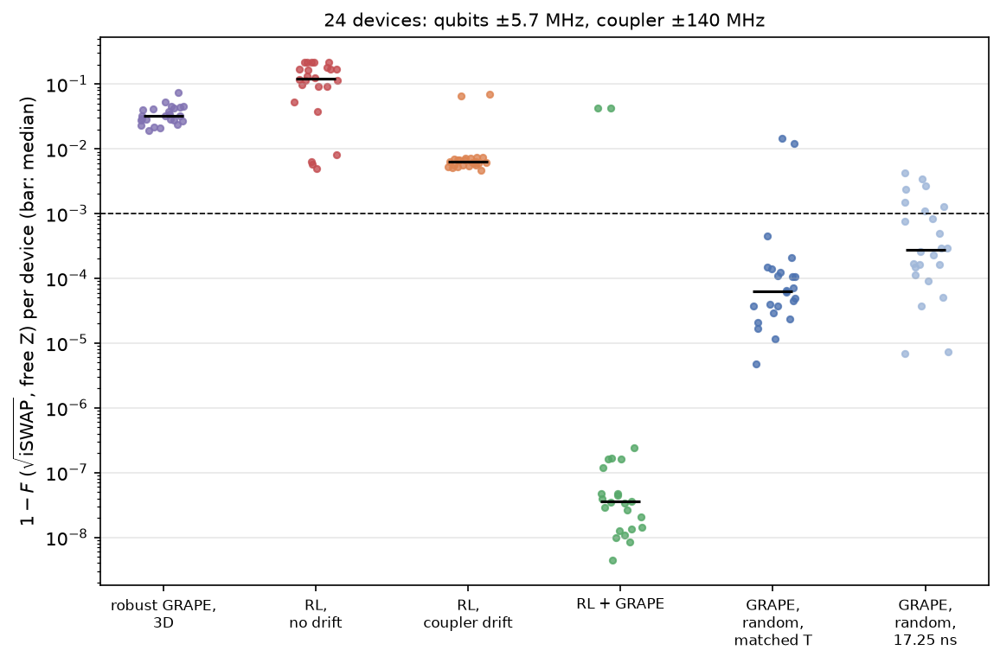
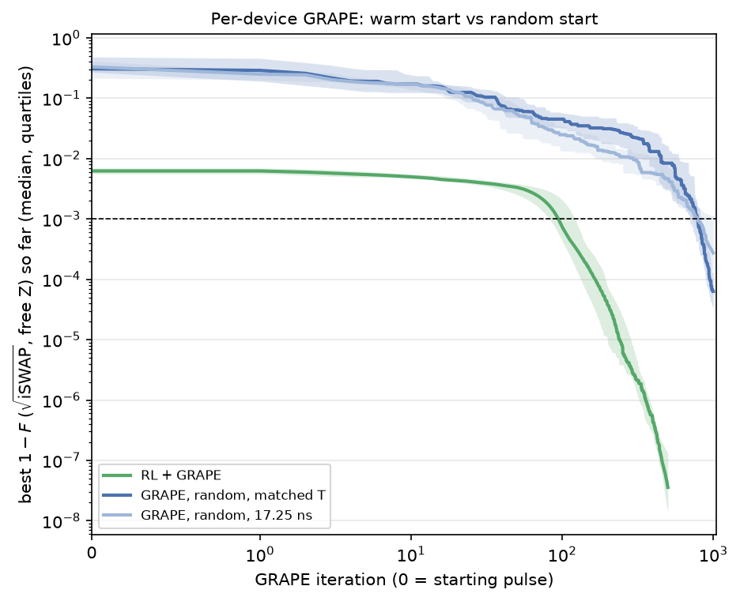
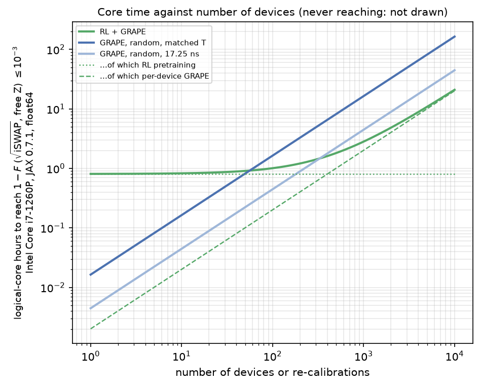

# Measurable observations and gate fidelity

**Question.** Does the [large-coupler-drift result](robustness.md#large-coupler-drift) survive when the
agent sees only what an experiment can measure, and is scored by a gate fidelity an experiment reports?
Idea i07 ("gecko"), runs in `runs/i07_gecko/`, policies saved in `results/i07_gecko/`.

**Answer so far.** Yes, and the policy itself does better. Under the √iSWAP fidelity no single
robust pulse covers the drift (0 % of devices), the policy trained on measured observations is
consistent across devices on its own (median 1 − F = 6.2e-3), and its pulse is still a far better GRAPE
starting point than a random guess at equal gate time and budget: 92 % of devices reach 1e-3 within
200-500 GRAPE steps, against none from random starts. On 2 of 24 devices the policy's pulse runs into
the amplitude bound early, which accounts for all the misses.

## What changed

| | [Large coupler drift](robustness.md#large-coupler-drift) (v2.15.0) | This page (idea i07) |
| --- | --- | --- |
| Target | Any perfect entangler, \(J_T = 1 - (C + 3U)/4\) | √iSWAP: \(1 - F\), average gate fidelity after free virtual-Z corrections, leakage included ([metric](../system/metrics.md#named-gate-fidelity-with-free-z-corrections)) |
| Observation | 12 complex state amplitudes (not measurable) | 63 measured values: readout populations of \|01⟩, \|10⟩, \|11⟩ and two-qubit Pauli expectations of \|0+⟩, \|+0⟩, \|+1⟩, coupler not read out ([observation](../code/environment.md#measured-observations-obs_modemeasured)) |
| Drift, devices, budgets | Qubits ±5.7 MHz, coupler ±140 MHz, 24 held-out devices, PPO 20M steps, robust GRAPE on 35 members | Same |

The two changes are separable: `--objective sqrt_iswap` and `--obs-mode measured`. A control run
with amplitude observations and the new objective isolates the effect of the observation. The pulses
optimised for the paper's objective sit 0.6-1.8 % away from √iSWAP (Weyl point (0.25, 0.25, 0.06-0.09),
√iSWAP plus a small conditional phase), so this is a different task, not a relabelling. GRAPE reaches
√iSWAP at 1 − F = 7e-5 in 17.25 ns and 1.2e-5 in 25 ns.

## Results on 24 held-out devices

| Method | 1 − F on devices: median [quartiles] | Reaches 1e-3 | One-off, core-hours | Per device, core-seconds |
| --- | --- | --- | --- | --- |
| Robust GRAPE, 3D ensemble (√iSWAP) | 3.2e-2 [2.7e-2, 4.2e-2] | **0 %** | 0.40 | never reaches |
| RL, measured observations, trained without drift | 1.2e-1 [8.1e-2, 1.7e-1] | 0 % | 0.81 | never reaches |
| RL, measured observations, trained over the drift | **6.2e-3** [5.6e-3, 7.0e-3] | 0 % | 0.81 | never reaches |
| RL (drift) → 500 GRAPE steps | **3.6e-8** [1.4e-8, 1.3e-7] | 92 % | 0.81 | **7.3** |
| GRAPE, random start, matched gate time (48 ns), 1000 steps | 6.3e-5 [3.5e-5, 1.3e-4] | 92 % | 0 | 59 |
| GRAPE, random start, 17.25 ns, 1000 steps | 2.7e-4 [1.4e-4, 1.1e-3] | 71 % | 0 | 16 |

Per-device core time is to the first iteration below 1e-3 (median over devices). The policy's gates
last 48 ns in the median (quartiles 46-49 ns).

| GRAPE steps | RL warm start: median 1 − F (reach 1e-3) | Random, matched gate time | Random, 17.25 ns |
| --- | --- | --- | --- |
| 0 | 6.2e-3 (0 %) | | |
| 50 | 3.3e-3 (0 %) | 6.4e-2 (0 %) | 5.4e-2 (0 %) |
| 100 | 7.4e-4 (54 %) | 4.5e-2 (0 %) | 2.5e-2 (0 %) |
| 200 | 3.7e-5 (92 %) | 3.1e-2 (0 %) | 1.3e-2 (0 %) |
| 500 | 3.6e-8 (92 %) | 8.4e-3 (0 %) | 4.6e-3 (4 %) |
| 1000 | | 6.3e-5 (92 %) | 2.7e-4 (71 %) |

The learning rate follows a cosine schedule over the whole run, so the numbers at a given step depend
on the run's length: with a 200-step schedule (the setting of the [original experiment](robustness.md#large-coupler-drift)),
200 steps give 4.1e-4 (54 %); with the 500-step schedule above, 3.7e-5 (92 %) at step 200.

## Measured versus amplitude observations

The same PPO setup and seed, trained over the same drift with the √iSWAP objective, once with the
measured observations and once with v1's amplitudes:

| Observation | Best nominal 1 − F in training | Policy alone on devices: median [quartiles] | + 200 GRAPE steps: median (reach 1e-3) | + 500 GRAPE steps: median (reach 1e-3) | Per device, core-seconds |
| --- | --- | --- | --- | --- | --- |
| **Measured** (63 values) | 5.4e-3 (still improving at 20M steps) | **6.2e-3** [5.6e-3, 7.0e-3] | 3.7e-5 (92 %) | 3.6e-8 (92 %) | 7.3 |
| Amplitudes (24 values) | 4.3e-3 (best at 6.4M steps) | 1.0e-2 [8.5e-3, 1.4e-2] | 3.7e-5 (88 %) | 4.2e-8 (88 %) | 8.0 |

Both refined with the same 500-step schedule. The policies differ on their own, where the one with
measured observations is 1.6× better and tighter across devices, but after refinement they are
equivalent. They miss different devices: the measured policy the 2 where it hits the amplitude bound,
the amplitude policy 3 others. With one seed each, the difference in the policy alone is not
established; what is established is that nothing is lost by observing only measurable quantities.
A plausible reason for the measured policy's edge is that the Pauli expectations present the phases the
fidelity depends on directly, where the amplitude observation gives them as raw angles of individual
amplitudes.

## Findings

1. **The large-coupler-drift result replicates with a hardware-style target and observations.** No
   single √iSWAP pulse covers the drift (0 % of devices, as for the perfect-entangler objective), and
   from the policy's pulse GRAPE reaches the target on 92 % of devices in 200-500 steps, where random
   starts at the same gate time reach none within 500 steps and need about 1000.
2. **The policy adapts better than with the paper's objective and observations.** Trained over the
   drift, it gives 1 − F = 6.2e-3 on every device, with quartiles within about ±12 %; the policy trained
   without drift fails on drifted devices (1.2e-1). In the original experiment the drift-trained policy
   was no better than the static one (1.3e-2 vs 1.5e-2).
3. **Compute.** 7.3 core-seconds per device against 59 for GRAPE at matched gate time and 16 for GRAPE
   at 17.25 ns; the 0.81 core-hours of training pay back after ≈ 56 and ≈ 330 devices respectively.
4. **A new failure mode.** On 2 of 24 devices (qubit detuning raised by about 9 MHz, coupler near
   nominal) the policy drives the amplitude into its bound at step 58 of 333; the episode ends at
   8.7 ns and there is nothing useful to refine (1 − F ≈ 4e-2 after 500 steps). These two devices are
   the entire 8 % that the warm start misses.

!!! warning "Limits"
    One seed per configuration; exact expectation values (no shot noise yet); the measured policy was
    still improving at 20M steps; refinement uses the learning rate tuned for the paper's objective
    (3e-4).

## What it would cost on hardware

Each observation needs its own experiments: 3 readout settings for the populations and 9 Pauli
settings for each of the 3 superposition inputs, 30 settings per step. At 1000 shots per setting, one
policy rollout of 333 steps is 1e7 shots, about 20 minutes at a 10 kHz repetition rate. That is affordable for
generating a device's pulse once, but not for training on hardware, which is why the policy is trained
in simulation. Training with fewer, coarser steps or fewer measurement settings would cut it; the
effect of finite shots is the next experiment.

## Next

1. **Finite shots**: replace the exact expectations by estimates from N shots per setting and repeat
   (the second half of this idea).
2. **Keep the policy inside the amplitude bound**: its pulses peak at |u| ≈ 19.6-19.9 of 20, and on two
   devices it crosses the bound at 8.7 ns. Clipping instead of ending the episode, or a margin penalty,
   should remove these failures.
3. **More seeds** for the measured-versus-amplitudes comparison, and training beyond 20M steps (the
   measured run was still improving).
