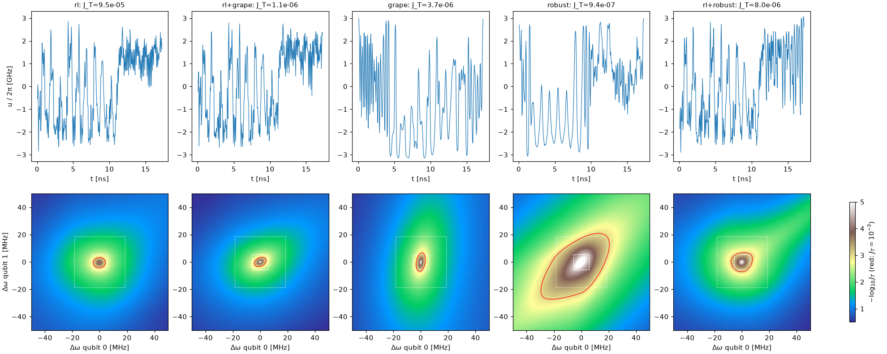
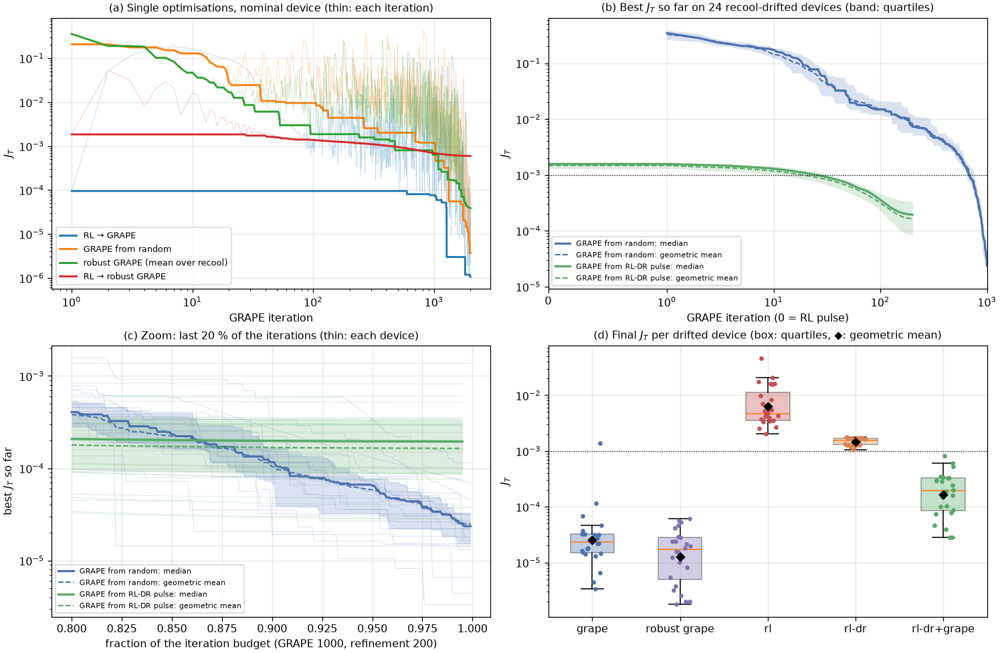
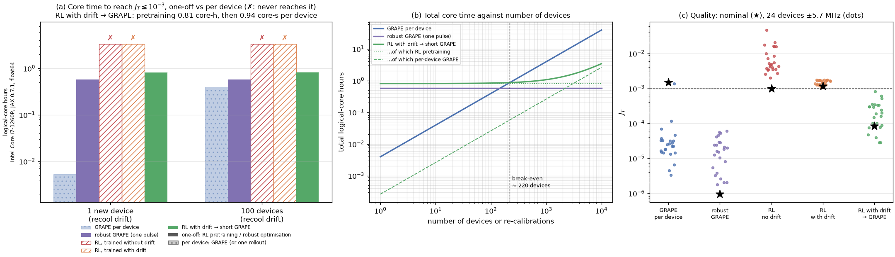
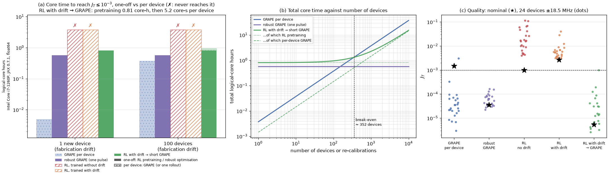

# Robustness to hardware drift

**Answer so far.** A single robust GRAPE pulse covers even the fabrication-targeting range
(J_T ≤ 7.6e-4 over ±18.5 MHz) when the two qubit frequencies drift, so in this model there is no need
for per-device adaptation. What an RL policy trained over the drift offers is a much better starting
point for per-device refinement: at equal gate time and GRAPE budget it beats a random start by 1-3
orders of magnitude. The single RL pulse itself is no more robust than a plain GRAPE pulse.

## How the experiments are calibrated

Every drift range on this page is a measured property of real fixed-frequency transmons, taken
from the literature collected in [Hardware drift ranges](../system/drift.md). Each range stands
for an operational question, and the results answer it in those terms:

| Hardware measurement | Range used | Operational question | Answer from this page |
| --- | --- | --- | --- |
| Frequency wander within one cooldown: 1-3 kHz typical, up to 20 kHz [[burnett2019]](../bibliography.md#burnett2019); single-TLS shifts 5-140 kHz [[schlor2019]](../bibliography.md#schlor2019); within 100 kHz over 95 h [[dhieb2025]](../bibliography.md#dhieb2025) | ±0.1 MHz | Does a calibrated pulse need re-calibrating during a cooldown? | **No.** Every pulse keeps its nominal J_T within a factor of ~4, in line with Burnett et al.'s conclusion that kHz shifts need no re-calibration. |
| "Recool stability of 5.7 MHz" after thermal cycling, IBM multi-qubit processors [[zhang2022]](../bibliography.md#zhang2022) | ±5.7 MHz | Does a pulse survive a warm-up and cool-down of the fridge? | **Only a robust one.** RL and plain GRAPE pulses come back at J_T ≈ 1.5e-3 on average (from 1e-4-1e-6) and need re-calibration; robust GRAPE stays ≤ 1.4e-4. |
| "Frequency assignment precision of 18.5 MHz" for new devices after laser annealing [[zhang2022]](../bibliography.md#zhang2022) | ±18.5 MHz | Can a pulse (or policy) designed on the model transfer to a newly fabricated chip? | **Only a pulse optimised for that range.** The recool-trained robust pulse reaches 6.5e-3 in the worst case, but robust GRAPE trained over ±18.5 MHz keeps J_T ≤ 7.6e-4 everywhere ([fabrication-range experiment](#fabrication-range-experiment)). |
| Flux-offset drift of 20 mΦ0 for the worst loop after 17 days [[dai2021]](../bibliography.md#dai2021), ≈ ±140 MHz of coupler frequency (assumed flux map) | coupler ±140 MHz, qubits ±5.7 MHz | Does anything survive the worst flux drift without re-calibration? | See [Large coupler drift](#large-coupler-drift) |

One hardware limit sits outside these numbers: the control can move the coupler by up to ±3.2 GHz,
more than a real flux-tunable coupler allows; see [Named gates and a richer model](../next/named-gates.md#limits-of-the-current-hamiltonian).

## Pulses under the three drift ranges

All pulses last 17.25 ns (the paper RL pulse's best time) and respect the RL bound
\(|u| \le 20\) rad/ns. Drift ranges are those of [Hardware drift ranges](../system/drift.md);
each is scored on an 11 × 11 grid of qubit detunings.

| Pulse | Nominal J_T | In-cooldown ±0.1 MHz: worst | Recool ±5.7 MHz: mean / worst | Fabrication ±18.5 MHz: mean / worst | Optimisation, core-minutes |
| --- | --- | --- | --- | --- | --- |
| RL (paper agent) | 9.5e-5 | 1.0e-4 | 1.5e-3 / 4.0e-3 | 1.4e-2 / 3.9e-2 | ~9 h training (v1, SB3) |
| RL → GRAPE | 1.1e-6 | 4.2e-6 | 1.9e-3 / 6.2e-3 | 2.0e-2 / 6.3e-2 | 0.7 |
| GRAPE, random start | 3.7e-6 | 5.9e-6 | 1.5e-3 / 4.7e-3 | 1.5e-2 / 5.0e-2 | 2.8 |
| **Robust GRAPE** (recool ensemble) | **9.4e-7** | **1.1e-6** | **3.1e-5 / 1.4e-4** | **8.6e-4 / 6.5e-3** | 35 |
| RL → robust GRAPE | 8.0e-6 | 9.5e-6 | 4.8e-4 / 1.4e-3 | 6.6e-3 / 2.5e-2 | 8.6 |

Compute is in logical-core minutes at the CPU's 2.1 GHz base clock ([how it is counted](#how-compute-is-counted));
robust GRAPE runs 25 detuned systems × 4 restarts × 2000 iterations.

Top: pulses. Bottom: \(-\log_{10} J_T\) on the paper's ±50 MHz map; red contour at \(J_T = 10^{-3}\);
white boxes: recool (dashed) and fabrication (dotted) ranges.

What the table says:

1. **In-cooldown drift does not matter.** Every pulse keeps its nominal J_T to within a factor of
   ~4 over ±0.1 MHz.
2. **Recool drift is where pulses break.** A single recool degrades the RL and GRAPE pulses from
   1e-4-1e-6 to ~2e-3 on average.
3. **RL's robustness is not special.** RL, RL → GRAPE and plain GRAPE have the same recool mean,
   ~1.5-1.9e-3. The paper's comparison with Krotov was at a different gate time (50 ns) and bound
   (1.5 GHz).
4. **Robust GRAPE wins on robustness,** and it also has the best nominal J_T. Its mean over the
   fabrication range, which it never trained on, is 8.6e-4.
5. **Starting robust GRAPE from the RL pulse is worse** than from random guesses: the RL solution
   sits in a narrow basin.

## GRAPE losses

(a) The single optimisations of the table above: J_T at each iteration (thin) and best so far
(thick); for robust GRAPE, the mean over the 25 systems. RL → GRAPE touches 1e-6. (b) Across the
24 drifted devices of the next section: median (solid), geometric mean (dashed) and quartile band
of the best J_T so far. (c) Zoom on the last 20 % of the iterations, each device thin. (d) Final J_T
on every drifted device for every method.

!!! note "Refinement needs small steps"
    Started from the RL pulse with Adam at step 0.01 (as in the table), GRAPE first jumps out of the
    RL pulse's basin (J_T up to 5e-2) and only improves once the step has decayed, after ~600
    iterations. With a step of 3e-4 it reaches J_T = 5e-7 in 50 iterations and 7e-9 in 200 from
    the paper's RL pulse. The per-device comparison below uses 3e-4.

## RL vs GRAPE: cost per device

The question where RL can win: a device that is re-calibrated after every cooldown, or a fleet of
devices, each with its own frequencies from the recool range. GRAPE pays its full cost for every
device; a policy trained with domain randomisation pays once, then produces each device's pulse in
a single rollout, and that pulse can seed a short GRAPE run.

Test set: the nominal device plus 24 devices with qubit frequencies drawn uniformly from the recool
range (±5.7 MHz on each qubit), none of them seen in training. Target: J_T ≤ 1e-3. Both RL agents
are PPO, seed 123, 20M steps; the drift-trained one redraws the qubit frequencies from the recool
range every episode.

### How compute is counted

Every cost on this page is **logical-core time**: the CPU time the computation takes on one logical
core of the laptop's Intel i7-1260P, with JAX in float64. A job that keeps 16 logical cores busy for
an hour counts as 16 core-hours. The costs are built from the steps each method actually took and
the measured price of each step (`scripts/bench_costs.py`, one pinned logical core,
single-threaded XLA):

| Step | Core time at 2.1 GHz |
| --- | --- |
| One PPO environment step, including its share of the policy and value updates | 145 µs (0.81 core-hours for 20M steps) |
| One GRAPE iteration, 17.25 ns pulse (345 samples), forward and backward | 21 ms |
| Same, 35 ns / 50 ns pulse (700 / 1000 samples) | 50 ms / 81 ms |
| One robust-GRAPE iteration, per ensemble member (345 samples) | 10.4 ms |
| One policy rollout (333 steps) | 25 ms |

A laptop's clock swings tenfold with load and temperature (400 MHz to 4.7 GHz on this one; the
benchmark ran at about 0.5 GHz while other training jobs throttled the chip). The benchmark therefore
samples the core's clock during every measurement and quotes cycles as time at the 2.1 GHz base
clock, so the numbers do not depend on how busy the machine was. At full turbo everything runs about
twice as fast. Wall-clock times from the runs themselves are not used: they were measured on a
shared, throttling machine with varying thread counts.

| Method | J_T nominal | J_T on drifted devices: median [quartiles] | Reaches 1e-3 | One-off, core-hours | Per device, core-seconds |
| --- | --- | --- | --- | --- | --- |
| GRAPE per device (1000 iterations, random start) | 1.5e-3* | 2.4e-5 [1.5e-5, 3.2e-5] | 96 % | 0 | 14 |
| Robust GRAPE (one pulse for all) | 9.4e-7 | **1.7e-5** [4.9e-6, 2.8e-5] | 100 % | 0.58 | 0 |
| RL trained without drift | 9.8e-4 | 4.7e-3 [3.5e-3, 1.1e-2] | 0 % | 0.81 | 0.03 (one rollout) |
| RL trained with drift | 1.2e-3 | 1.6e-3 [1.3e-3, 1.7e-3] | 0 % | 0.81 | 0.03 (one rollout) |
| RL with drift → 200 GRAPE steps | 8.5e-5 | 2.0e-4 [8.6e-5, 3.3e-4] | 100 % | 0.81 | **0.94** |

\* A single random restart on the nominal device happened to stall; the drifted devices show the
typical GRAPE result.

!!! warning "Gate times differ in this comparison"
    The RL pulses here are cut at their best step, 38 ns in the median, while GRAPE from scratch runs at
    17.25 ns, so the quality columns do not compare equal gate times. The
    [fabrication-range control](#the-gate-time-confound-and-its-control) repeats GRAPE at matched gate
    times and finds the RL warm start still far better at equal budget.

What it shows:

1. **Training with drift works as intended.** The drift-trained agent's gates hardly change across
   devices (quartiles 1.3-1.7e-3), whereas the agent trained on one device degrades by 5× and
   scatters over a decade. The policy adapts; it just does not reach 1e-3 on its own.
2. **An RL pulse is a warm start that cuts GRAPE's compute per device 15×.** From the drift-trained
   agent's pulse, about 16 small GRAPE steps (median) reach 1e-3 on every device: 0.94 core-seconds against
   14 for GRAPE from a random guess. Each step is dearer (the RL pulse is 38 ns, 2.4× the samples of
   GRAPE's 17.25 ns), but far fewer are needed.
3. **Amortisation pays off after ~220 devices.** Training costs 0.81 core-hours once. Against GRAPE from scratch, RL + short GRAPE is
   cheaper after 0.81 h / (14 s − 0.94 s) ≈ 220 devices or recalibrations.
4. **Within the recool range, one robust pulse is enough.** Robust GRAPE's single pulse beats every
   per-device method on quality (median 1.7e-5) and needs nothing per device. Adaptation only matters
   when the drift is larger than what one pulse can cover.

**Where RL should win, and the next experiment.** Over the fabrication-targeting range
(±18.5 MHz), robust GRAPE's worst case already degrades to 6.5e-3 (table above). That is where a
policy that adapts per device, plus a short refinement, should beat both a single robust pulse and
per-device GRAPE.

## Fabrication-range experiment

The same comparison over the fabrication-targeting range (±18.5 MHz on each qubit): a PPO agent
trained with drift redrawn every episode over ±0.35 % (±17.6 MHz and ±20.6 MHz on the two qubits),
robust GRAPE on a 5 × 5 ensemble spanning ±18.5 MHz, and 24 held-out devices drawn from the range.

**A single robust pulse still covers the whole range.** Robust GRAPE trained over ±18.5 MHz:

| Pulse | Nominal J_T | Recool: mean / worst | Fabrication: mean / worst | Optimisation, core-minutes |
| --- | --- | --- | --- | --- |
| Robust GRAPE, recool ensemble (above) | 9.4e-7 | 3.1e-5 / 1.4e-4 | 8.6e-4 / 6.5e-3 | 35 |
| **Robust GRAPE, fabrication ensemble** | 3.5e-5 | 3.7e-5 / 6.4e-5 | **1.0e-4 / 7.6e-4** | 35 |
| RL → robust GRAPE, fabrication ensemble | 1.9e-4 | 2.3e-4 / 4.2e-4 | 7.9e-4 / 4.1e-3 | 8.6 |

Trading a little nominal quality buys a pulse with J_T ≤ 7.6e-4 everywhere in the fabrication range.
With two drifting frequencies, even ±18.5 MHz is not wide enough to need per-device adaptation in
this model.

| Method | J_T on devices: median [quartiles] | Reaches 1e-3 | One-off, core-hours | Per device, core-seconds |
| --- | --- | --- | --- | --- |
| GRAPE per device (17.25 ns, random start) | 3.1e-5 [1.9e-5, 6.5e-5] | 96 % | 0 | 13.5 |
| Robust GRAPE, fabrication ensemble | 5.5e-5 [3.4e-5, 8.1e-5] | 100 % | 0.58 | 0 |
| RL trained without drift | 1.6e-2 [8.4e-3, 4.3e-2] | 0 % | 0.81 | 0.03 (one rollout) |
| RL trained over the fabrication range | 5.5e-3 [3.7e-3, 6.8e-3] | 0 % | 0.81 | 0.03 (one rollout) |
| RL (fabrication range) → 200 GRAPE steps | **1.4e-5** [5.8e-6, 4.2e-5] | 100 % | 0.81 | 5.2 (until 1e-3) |

### The gate-time confound, and its control

The policy's pulse is cut at its best step, which here falls at 45 ns (median; quartiles 41-48 ns,
`docs/figures/gate_times.json`), while GRAPE from scratch runs at 17.25 ns. A longer pulse gives GRAPE
more freedom, so "RL → GRAPE beats GRAPE" could simply mean "a 45 ns pulse beats a 17 ns pulse". The
control is GRAPE from a random guess **at each device's own RL gate time** (`scripts/matched_gate_time.py`):

| GRAPE steps | Core-seconds per device (45 ns pulse) | From a random guess, matched gate time: median J_T (reach 1e-3) | From the RL pulse: median J_T (reach 1e-3) |
| --- | --- | --- | --- |
| 50 | 3.6 | 4.9e-2 (0 %) | 1.9e-3 (17 %) |
| 100 | 7.1 | 3.0e-2 (0 %) | 4.1e-4 (67 %) |
| 200 | 14 | 1.3e-2 (0 %) | 1.4e-5 (100 %) |
| 500 | 36 | 6.6e-5 (96 %) | 3.8e-8 (100 %) |

At equal gate time and equal GRAPE budget the RL warm start is 1-3 orders of magnitude better, and
it reaches the target in 200 steps where a random start needs close to 500. **The warm start is
genuinely informative, not an artefact of pulse length.** A longer gate is itself a cost on hardware
(more decoherence), which these closed-system numbers do not include.

### Training and refinement budgets

J_T of the RL (fabrication range) policy at earlier checkpoints, alone and after 200 GRAPE steps:

| Training | Core-minutes | Policy alone: median J_T | + 200 GRAPE steps: median J_T | Reach 1e-3 |
| --- | --- | --- | --- | --- |
| 2M steps | 4.9 | 1.2e-2 | 7.3e-8 | 88 % |
| 5M | 12 | 8.4e-3 | 2.8e-4 | 79 % |
| 10M | 24 | 4.7e-3 | 1.8e-4 | 92 % |
| 20M (final policy) | 48 | 8.1e-3 | 1.2e-3 | 38 % |

The policy's own quality improves up to 10M steps; the final policy had degraded (the late PPO
instability seen in [Training](training.md)), so the best checkpoint should be used, as in the main
table. The refined quality does not follow training monotonically: it depends on where each
checkpoint's pulses end, i.e. on gate time. A policy trained for **2M steps** (4.9 core-minutes, a tenth
of the budget) is already a good warm start, which moves the break-even against per-device GRAPE
from ~350 devices (full training) to about 36.

**Where the per-device saving is smaller.** On this range the warm start saves 2.6× per device
(5.2 against 13.5 core-seconds), less than the 15× of the recool range. The policy's pulses are
longer here (45 ns, 906 samples), and a GRAPE iteration on them costs 3.4× one on GRAPE's 17.25 ns
pulse. The number of iterations falls ninefold (median 646 → 73); the price of each rises 3.4×. A policy
trained with a gate-time penalty would recover much of the difference.

### What the fabrication range shows

1. **One robust pulse still suffices for two drifting frequencies**, even over ±18.5 MHz.
2. **The RL policy alone does not reach 1e-3** at this range, but it is a strong warm start: at equal
   gate time and GRAPE budget it beats a random start by 1-3 orders of magnitude.
3. **Where RL can win is therefore not "one pulse per range" but "fast per-device refinement"**, and
   that advantage matters only when no single robust pulse covers the range, i.e. with more sensitive
   drifting parameters; see [test T1](../hypothesis/drift-and-dimension.md#t1-policies-trained-with-more-drifting-parameters).

## Large coupler drift

!!! info "Running"
    Qubits drifting over the recool range (±5.7 MHz) and the coupler over ±140 MHz, the worst-loop
    flux drift after 17 days ([Hardware drift ranges](../system/drift.md#the-coupler-drifts-too-and-more)).
    Robust GRAPE over a 35-member ensemble spanning both, a PPO policy trained over the same drift, and
    per-device GRAPE with and without the policy's warm start at matched gate time.
