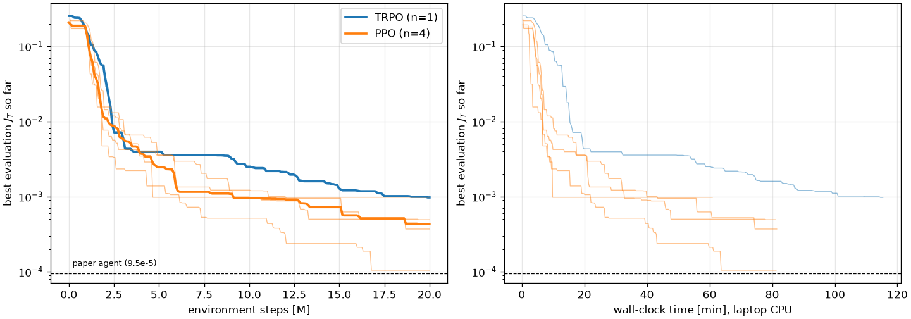
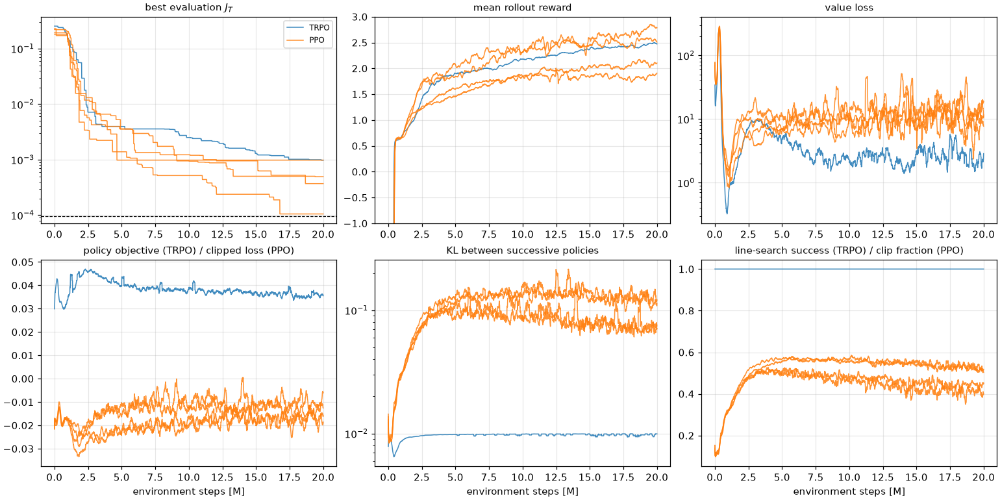

# Training RL agents

**Answer so far.** PPO is at least as good as TRPO on this task and about twice as fast. Across four
PPO seeds the best gate ranges from J_T = 1.1e-4 to 9.8e-4. The best seed matches the paper's agent
(9.5e-5), so the gap seen in our first TRPO run was seed-to-seed variation, not a flaw in the JAX
re-implementation.

Setup for every run: the paper's environment and budget (20M environment steps, 8,192 steps per
update, [128, 128] ReLU networks, harmonic learning-rate decay from 3e-4), float64 on the laptop CPU.

## Best gate per run

Left: best evaluation J_T so far against environment steps (thin: each seed, thick: median).
Right: the same against wall-clock time. Dashed: the paper's agent.

| Run | Best J_T | 1 − U at the best step | Reached at | Steps until J_T < 1e-2 | Wall time |
| --- | --- | --- | --- | --- | --- |
| TRPO, seed 123 | 9.8e-4 | 1.3e-3 | 19.9M | 2.4M | 115 min |
| PPO, seed 123 | 9.8e-4 | 1.3e-3 | 4.7M | 3.1M | 61 min |
| PPO, seed 1 | 4.9e-4 | 6.4e-4 | 19.4M | 1.9M | 81 min* |
| PPO, seed 2 | 3.7e-4 | 4.9e-4 | 18.7M | 2.8M | 81 min* |
| PPO, seed 3 | **1.1e-4** | 1.4e-4 | 16.8M | 1.8M | 81 min* |
| **PPO, median of 4** | **4.3e-4** | 5.7e-4 | | 2.4M | |
| Paper agent (v1, TRPO) | 9.5e-5 | 1.3e-4 | 12.6M | | ~9 h |

\* Seeds 1-3 ran in parallel with other jobs on the same CPU. Alone, a PPO run takes about an hour.

- **The breakthrough is reproducible.** Every run crosses J_T = 1e-2 between 1.8M and 3.1M steps,
  where the paper's agent broke through as well.
- **The remaining error is leakage.** At every best step the concurrence is 1 and J_T ≈ ¾(1 − U).
  The agent finds the entangling interaction early and then slowly learns to keep population in
  the computational subspace.
- **Seeds matter more than the algorithm.** One seed of either algorithm says little: PPO seeds
  span a factor of 9 in best J_T.

## Losses and training diagnostics

Smoothed over 20 updates. TRPO in blue, the four PPO seeds in orange.

- **Mean rollout reward** rises within the first million steps as the agent stops leaving the
  amplitude bound (each violation costs up to −20).
- **Value loss** spikes during that phase, then settles; it stays higher for PPO than for TRPO.
- **KL between successive policies:** TRPO holds its 0.01 limit by construction.
- **PPO updates are too aggressive.** Its KL per update settles near 0.1 and its clip fraction near
  0.5; healthy PPO training usually sits around 0.01-0.02 and 0.1-0.2. This is the likely reason
  PPO's evaluation J_T wanders late in training (seed 123 was at 3e-3 at 20M after 9.8e-4 at 4.7M),
  so the best checkpoint, not the last, should be kept.

!!! tip "Next tuning step"
    Fewer PPO epochs per update (10 now), a target-KL early stop, or larger minibatches should bring
    the KL down. Given the seed spread, compare settings on at least four seeds.

## What this means

For the paper's task, a single PPO run on a laptop reaches the paper's result in about an hour.
The trained agents' residual leakage is also what [GRAPE refinement](robustness.md) removes in
seconds. The more interesting question is therefore not how to squeeze more out of training but
what a trained agent buys over re-optimising: see [Robustness to hardware drift](robustness.md).
