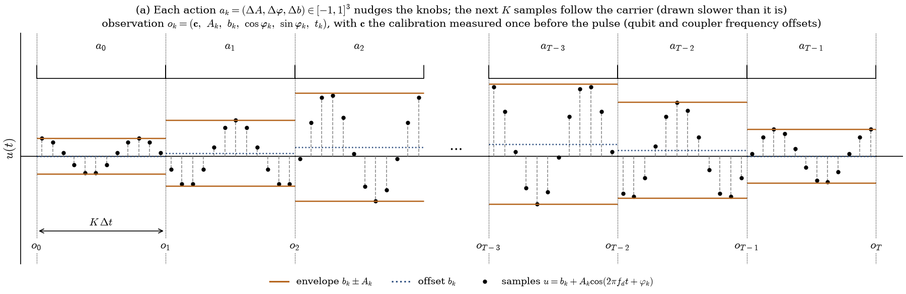
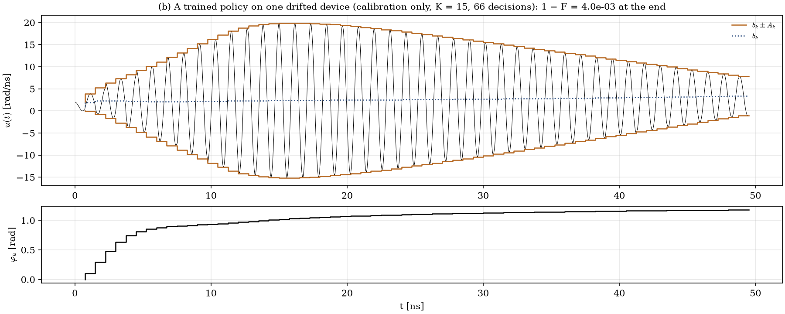
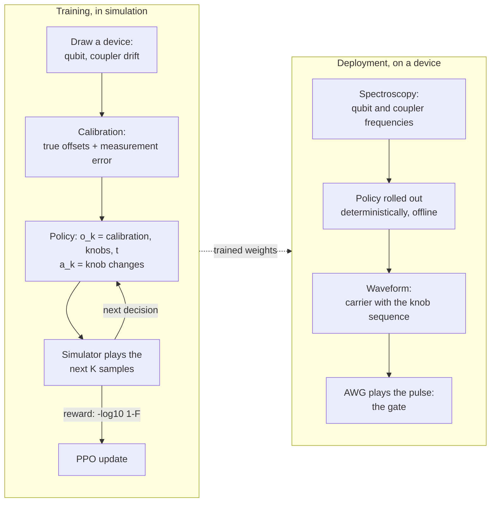

# The calibration policy: a new MDP

The paper's agent builds a pulse sample by sample and watches the quantum state while it does. That
works in simulation, but on hardware the state is not observable, a gate must survive drift, and every
observation costs shots. Ideas [gecko](../ideas/gecko.md), [ibis](../ideas/ibis.md) and
[jackal](../ideas/jackal.md) change the decision problem step by step. This page describes where it
has arrived, the **carrier calibration MDP**, and why each change was made.

## What changed, in one table

| | Paper (v1) | Calibration policy (ibis, jackal) |
| --- | --- | --- |
| What the agent observes | The quantum state: 12 complex amplitudes of the evolving computational states (not measurable) | **A calibration of the device, measured once before the pulse**: the offsets of both qubit frequencies and the coupler frequency from nominal, in MHz, as spectroscopy gives them (with measurement error). Plus its own knobs and the time |
| Observation size | 28 | **8**: 3 calibration numbers, 4 knob values (A, b, cos φ, sin φ), time |
| What an action is | 3 per-sample amplitude changes Δu, summed into the pulse | **3 knob changes** (ΔA, Δφ, Δb) of a carrier u(t) = b + A cos(2π f<sub>d</sub> t + φ) |
| Pulse between decisions | Piecewise constant, 3 samples | The carrier with the current knobs, K samples (15 in the best ibis policy, 50 of 0.1 ns on the device) |
| Carrier frequency f<sub>d</sub> | none | The qubit-qubit detuning **as measured by the calibration** (nominal + measured offsets) |
| Decisions per pulse | 333 | 66 (ibis, K = 15); 20 (jackal, 100 ns) |
| Amplitude bound | Leaving it ends the episode | Clipped, with a penalty on the excess |
| Reward | −log<sub>10</sub> J<sub>T</sub> (perfect entangler) per step | −log<sub>10</sub>(1 − F) per step, F the average gate fidelity to √iSWAP after free virtual-Z corrections, leakage included |
| Loop at deployment | Closed loop on the state | **Open loop**: calibrate, roll the policy out, play the pulse |
| Data per pulse on hardware | Not possible (the state is not observable) | One calibration, about 1e4 shots |

## How a pulse is built

<figure markdown>
  
  <figcaption markdown="span">At each decision point o<sub>k</sub> the policy sees the calibration, its
  current knobs and the time, and outputs a<sub>k</sub> = (ΔA, Δφ, Δb) ∈ [−1, 1]³, scaled to at most
  (1 rad/ns, 0.2 rad, 1 rad/ns) in ibis. The next K samples follow the carrier with the updated knobs. The
  carrier runs in absolute time, so it stays continuous across decisions; only a change of phase or
  amplitude makes a small step at the boundary. Compare the paper's per-sample actions
  ([home page](../index.md#how-it-works-v1-the-published-design)).</figcaption>
</figure>

<figure markdown>
  
  <figcaption markdown="span">What a trained ibis policy (calibration only, K = 15) plays on one of the
  held-out drifted devices: the envelope b ± A (orange), the offset b (blue, dotted), the pulse (black) and
  the phase φ. It ramps the amplitude up to the bound within about 15 ns, holds it, and ramps it down; it moves
  the phase by about 1 rad in the first 5 ns (a small shift of the effective frequency) and keeps a small offset
  of 2-3 rad/ns. The final gate on this device: 1 − F = 4.0e-3.</figcaption>
</figure>

## Training and deployment



The simulator is only used in training: it supplies the reward and plays the pulse. At deployment
nothing is measured during the pulse. The policy never sees the Hamiltonian, the fidelity or the state,
only the calibration, so the same weights work on any device whose calibration it can read. What it can
not see (drift of the couplings or anharmonicities, a stale calibration) is tested separately on the
[ibis](../ideas/ibis.md) page.

## Why these changes

1. **Observe the device, not the state.** The right pulse depends only on the device, which does not
   change during the pulse. Observing the evolving state (the paper's choice) makes the policy a feedback
   controller that needs a measurement at every step: 1e7 shots per pulse, and with finite shots it
   falls apart (30× worse at 1e6 shots). A calibration is measured anyway, once, and is enough.
2. **Steer slow knobs, not samples.** A good pulse rides on a carrier near the qubit detuning (0.86 GHz
   in the paper's model, 43 periods in 50 ns). A policy that only sees a clock cannot synthesise that
   carrier sample by sample: with per-sample actions and calibration-only observations it stayed at the
   identity gate for 20M steps. With the carrier given, it reached 1e-2 in 0.72M steps. It is also how
   gates are driven in a lab: a calibrated carrier with shaped envelope and phase.
3. **Few, long steps.** 66 decisions learn well; 333 small knob decisions learn badly or not at all.
4. **Keep the pulse.** Clipping with a penalty replaces ending the episode at the amplitude bound, so a
   single overshoot no longer destroys a device's gate.
5. **A fidelity a lab reports.** The average gate fidelity to √iSWAP with free Z (virtual Z gates cost
   nothing on hardware), instead of "any perfect entangler".

## In the code

```python
cfg = EnvConfig(objective="sqrt_iswap", obs_mode="context", action_mode="carrier",
                oob_mode="clip", n_time_steps=15)                       # ibis
cfg = EnvConfig(physics_model="device", obs_mode="context", action_mode="carrier", ...)   # jackal
```

CLI: `--objective sqrt_iswap --obs-mode context --action-mode carrier --oob-mode clip --n-time-steps 15`,
or `--physics device` for the realistic model. The step with the carrier is in `env.py` (`step`,
`action_mode == "carrier"`) and `env_device.py`; the calibration is built in `reset_params`.
