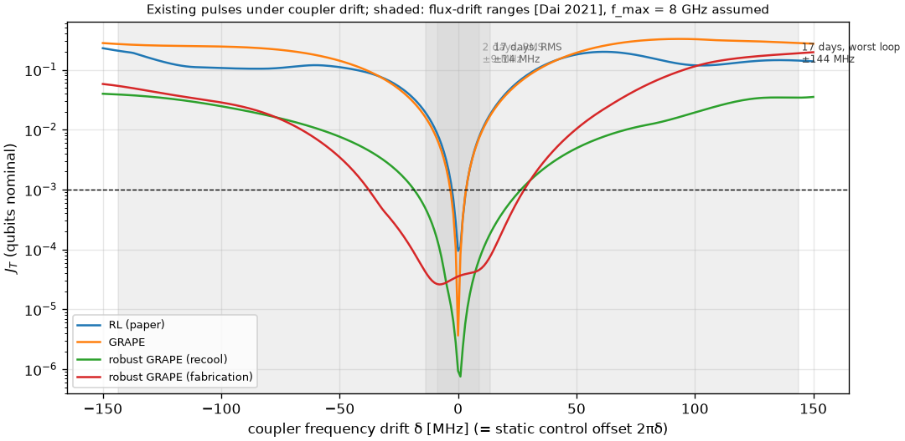

# Hardware drift ranges

Robustness numbers only mean something against a drift range the hardware actually shows. This
page fixes those ranges from measurements on fixed-frequency transmons, the qubit type in our
model. They are encoded in `rlquantopt/jx/drift.py` and used for robust GRAPE, for scoring
pulses, and for domain randomisation.

## The three ranges

| Range | Half-width on each qubit | Timescale | Evidence |
| --- | --- | --- | --- |
| **In-cooldown** | ±0.1 MHz | hours to days | Frequencies "remain generally stable with variations confined to a 100 kHz-interval" over 95 h ([Dhieb et al. 2025](https://arxiv.org/abs/2512.18037)). Single two-level-system (TLS) fluctuators shift the qubit by 5-140 kHz ([Schlör et al., PRL 123, 190502 (2019)](https://doi.org/10.1103/PhysRevLett.123.190502)). Typical shifts of 1-3 kHz, infrequently up to 20 kHz, over several days ([Burnett et al., npj QI 5, 54 (2019)](https://doi.org/10.1038/s41534-019-0168-5)). |
| **Recool** | ±5.7 MHz | between cooldowns | "Cryogenic-to-ambient thermal cycling … yields a recool stability of 5.7 MHz" on IBM multi-qubit processors ([Zhang et al., Sci. Adv. 8, eabi6690 (2022)](https://doi.org/10.1126/sciadv.abi6690)). |
| **Fabrication targeting** | ±18.5 MHz | a new device | "Frequency assignment precision of 18.5 MHz" after laser annealing, including pre-cooldown steps ([Zhang et al. 2022](https://doi.org/10.1126/sciadv.abi6690)). |

The sources report spreads (a precision or a stability), not hard bounds. We use each number as
the half-width of a uniform box on both qubits, which covers roughly ±1σ; the worst case over the
box is therefore a typical bad case, not an extreme one.

## What they imply for this project

- **In-cooldown drift is negligible for our gates.** 0.1 MHz over a 17 ns gate is a phase error of
  \(2\pi \times 0.1\,\text{MHz} \times 17\,\text{ns} \approx 0.01\) rad. Every pulse we have keeps
  its nominal J_T across this range (see [Robustness](../results/robustness.md)).
- **Recool drift is the relevant range for robustness.** Pulses must survive a thermal cycle
  without re-optimisation. 5.7 MHz is 0.11 % of 5.0311 GHz and 0.10 % of 5.8899 GHz, so the paper's
  ±0.1 % domain randomisation corresponds to this range.
- **Fabrication targeting is the range for transfer between devices.** A policy that works across
  ±18.5 MHz could be reused on a new chip without retraining. That is where a trained policy can
  beat per-device optimisation.
- **The paper's ±50 MHz maps** (Figs. 10-17) cover about 2.7× the fabrication-targeting range.
  They show the shape of the landscape but overstate the drift a calibrated device sees.

## Where the ranges are used

| Range | Used for | Result |
| --- | --- | --- |
| In-cooldown ±0.1 MHz | Scoring pulses | No re-calibration needed within a cooldown ([Robustness](../results/robustness.md#how-the-experiments-are-calibrated)) |
| Recool ±5.7 MHz | Robust-GRAPE ensemble; domain randomisation of the RL agent (`--max-drift 1.1e-3`); the 24 test devices of the cost-per-device experiment | Robust GRAPE survives a recool; single pulses do not ([Robustness](../results/robustness.md)) |
| Fabrication ±18.5 MHz | Scoring transfer to a new device; the fabrication-range experiment | A robust pulse trained on this range covers it ([Robustness](../results/robustness.md#fabrication-range-experiment)) |
| Coupler ±140 MHz (worst-loop flux drift) | Large coupler drift experiment; gecko and ibis | [Robustness](../results/robustness.md#large-coupler-drift), [Measurable](../results/measurable.md), [ibis](../ideas/ibis.md) |
| Coupler flux ±20 mΦ₀ with qubits ±5.7 MHz (physical units) | The realistic device model | [jackal](../ideas/jackal.md) |

## What is not covered yet

### The coupler drifts too, and more

The coupler is flux-tunable, and flux-tunable elements are much less stable than fixed-frequency
qubits: [Burnett et al. (2019)](https://doi.org/10.1038/s41534-019-0168-5) contrast their kHz-level
drift with "the approximately 500 kHz frequency instability found in flux-tuneable qubits". Over
days and weeks the flux offset itself wanders. [Dai et al. (2021)](https://doi.org/10.1103/PRXQuantum.2.040313)
measured, on a device kept cold: "After two days, the root mean square (RMS) change in flux offsets
[…] is 1.3 mΦ0. After 17 days, one of the resonator SQUID fluxes changed by 20.0 mΦ0. The others have
an RMS change of 2.0 mΦ0."

Turning flux into coupler frequency needs the coupler's flux map, which the paper's model does not
have. Assuming a symmetric-SQUID coupler with a maximum frequency of 8 GHz, parked at our 7.445 GHz
(about 6.8 MHz per mΦ0 there):

| Flux drift [Dai et al. 2021] | Coupler frequency drift (assumed f_max = 8 GHz) |
| --- | --- |
| 1.3 mΦ0 RMS, after 2 days | ±9 MHz |
| 2.0 mΦ0 RMS, after 17 days | ±14 MHz |
| 20 mΦ0, worst loop after 17 days | −144 / +127 MHz, used as **±140 MHz** |

A higher f_max, or parking further from the sweet spot, makes the slope and the drift larger.

!!! tip "In flux units: the realistic device model"
    The [jackal](../ideas/jackal.md) device model (i10) has the coupler's flux map (an asymmetric SQUID,
    Sung et al. 2021 parameters), so its drift is drawn directly in flux, up to ±20 mΦ₀ (about −178 MHz of
    coupler frequency at its idle point), together with the qubit frequencies (±5.7 MHz) and, optionally,
    the couplings and anharmonicities, which a spectroscopy calibration does not measure.

In the paper's model the coupler term is \(2\pi(\omega_c - \omega_r) b^\dagger b + u(t)\, b^\dagger b\), so a
coupler drift \(\delta\) is exactly a static offset \(2\pi\delta\) on the control line. How far each
pulse tolerates it (`scripts/coupler_drift_scan.py`):



| Pulse | Coupler window with J_T ≤ 1e-3 |
| --- | --- |
| RL (paper) | 5 MHz wide |
| GRAPE | 6 MHz wide |
| Robust GRAPE, recool ensemble (qubits only) | 44 MHz wide |
| Robust GRAPE, fabrication ensemble (qubits only) | 64 MHz wide |

Typical weeks-scale coupler drift (±14 MHz) is covered by the robust pulses although they never saw
coupler drift. The worst-loop drift (±140 MHz) breaks every existing pulse, and is used for the
[large coupler drift experiment](../results/robustness.md#large-coupler-drift).

Further sources of slow drift, not modelled: aging of junctions across many cooldowns (a
cumulative ~61 MHz downward shift over more than a year and 10 thermal cycles in
[Dhieb et al. 2025](https://arxiv.org/abs/2512.18037)), and calibration drift of the control
electronics.

## Using the ranges in code

```python
from rlquantopt.jx.drift import DRIFT_RANGES, box_grid
rng = DRIFT_RANGES["recool"]                  # DriftRange(name, half_width_mhz=5.7, timescale, source)
d0, d1 = box_grid(rng.half_width_mhz, 11)     # MHz grid for scoring a pulse
omegas = grape.detuning_grid(model, rng.half_width_mhz, 5)   # ensemble for robust GRAPE
```

For training with domain randomisation, `--max-drift` is a fraction of each frequency:
`--max-drift 1.1e-3` gives ±5.5 MHz on qubit 0 and ±6.5 MHz on qubit 1, approximately the recool range.
